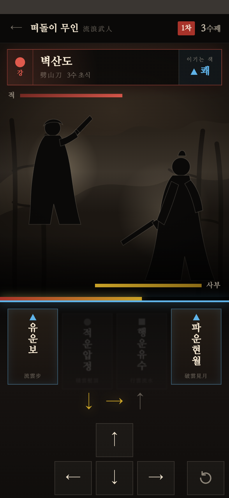
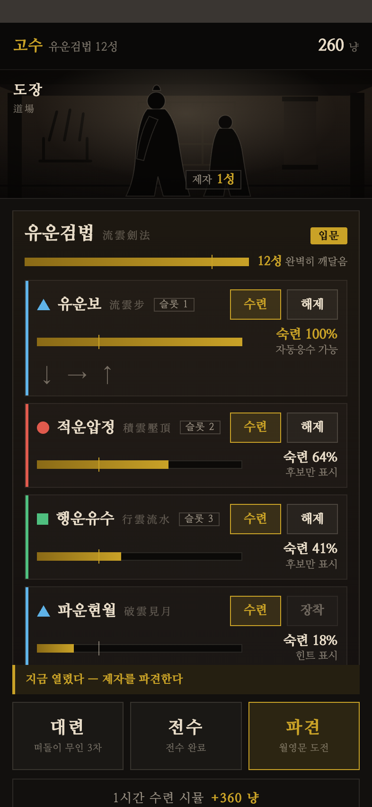

# 화면 UI·아트 재설계 — UI·UX 결정 로그

## 배경 & 목적

현행 v2 빌드는 코어 루프(후보 필터 시퀀스 입력 · 6단 공방 판정 · 숙련 4단계 · 전수 · 파견)가 전부 동작하지만, 화면은 v0 시절의 다크 카드 리스트를 그대로 물려받은 **관리 대시보드 톤**이다. 제안서가 파는 것은 「손으로 익힌 초식이 자동화되는 순간」과 「당신이 익힌 만큼 제자가 대신 싸운다」인데, 화면에는 손맛도 강호의 공기도 사람 형상도 없다.

본 사이클의 목적은 **로직을 건드리지 않고 화면의 시각 언어를 무협으로 옮기는 것**이다. 판정·입력·성장 규칙은 `docs/design/1.01-프로토타입-v2/spec_프로토타입_v2_통합_PRD.md` 가 SoT 이며, 본 로그는 그 규칙이 **어떻게 보이는가**만 결정한다.

입력 자료:

- 현행 빌드 스크린샷 15종 — `docs/screenshots/` (#53, 393×852 스테이지 영역만 촬영)
- UI·그래픽 스타일 레퍼런스 조사 — `docs/research/2026-09-01_UI-아트-레퍼런스-조사.md` (#25/PR #26). 5축 조사 + 그래픽 스타일 후보 3안, 권고 = ① 먹 실루엣
- 아트 톤 결정 (운영자, 2026-09-01 대화) — **톤의 주인은 무협(팽팽·절제)**, 아이들 아케이드의 코지·둥글둥글 관습은 배제. 주 타깃 10~30대 남성 무협 팬. 본 로그의 § 횡단 결정 D-1 이 이 결정의 정식 기록처다
- 용어 SoT — `docs/design/glossary.md`

**스코프 (운영자 확정, 2026-09-01)**: 「스킨 + 아레나」. 팔레트·서체·한자 조판 재정의 + 6단 판정 다중 부호화 + 게임필 3종 + 대련/파견 화면의 빈 공간을 아레나(배경 레이어 + 먹 실루엣 2인)로 채우는 데까지. 캐릭터는 **정지 실루엣**까지 확정하고 프레임 애니메이션은 § 잔여 논의로 남긴다. 리서치 § 8 의 권고 순서 (a) 팔레트·조판 + juice → (b) 아레나 배경 → (c) 캐릭터 애니메이션 중 (a)(b) 구간에 해당하며, 둘 다 에셋 생성과 병렬 착수가 가능한 구간이다.

**스코프 밖**: 정보 구조·화면 전환 흐름의 재설계(전면 재설계안은 M1 통합 PRD 가 `build착수` 상태라 파일 스코프가 크게 겹쳐 기각), 사운드(M3), 로컬라이즈(M3), 접근성 옵션 UI 노출(M3 — 단 색 이외 부호화는 본 사이클에서 이미 다룬다).

### 작업 방식

- **viewport**: 393×852 (repo 의 `#stage` 논리 해상도 — iPhone SE 기본값 대신 이 프로젝트의 실제 스테이지를 따른다)
- **캡처 파이프라인**: Chrome headless `--window-size=393,852 --force-device-scale-factor=2 --virtual-time-budget=8000`, `?capture=1` 로 아트보드 (0,0) 고정. 화면당 클린본 + 주석본 2벌
- **목업 위치**: `docs/design/1.02-화면-UI-아트-재설계/mockups/` (HTML · `assets/` 실물 에셋), 시안 PNG 는 결정 로그와 같은 폴더

## 화면 인벤토리 & 흐름

| # | 화면 | 역할 | 우선순위 | 현행 스크린샷 |
|---|---|---|---|---|
| S1 | 대련 | 사부가 직접 치는 실전. 캐릭터·배경·6단 판정 이펙트가 모두 모이는 화면 — **나머지 4화면이 여기서 시각 언어를 상속한다** | 1 | `06`, `07` |
| S2 | 도장 | 홈. 무공·초식 목록, 숙련/성 게이지, 하단 액션 바(대련·전수·파견) | 2 | `01`, `05`, `09`, `10` |
| S3 | 수련 | 「손으로 익힌다」의 본체. 구결 · 후보 필터 진행 · 방향 입력 | 3 | `02`, `03`, `04` |
| S4 | 파견 관전 | 제자가 대신 싸우는 것을 지켜보는 화면 + 선택적 지시. 감정적 정점 | 4 | `12`, `13`, `14` |
| S5 | 전수 | 사부 → 제자로 무공이 복사되는 순간 | 5 | `11` |
| S6 | 결과 | 승/패 정산 (대련·파견 공용) | 6 | `08`, `15` |

흐름: `도장 ⇄ 수련` · `도장 → 대련 → 결과 → 도장` · `도장 → 전수 → 도장` · `도장 → 도전자 예고 → 파견 관전 → 결과 → 도장`.

S1 을 먼저 확정한 뒤 그 팔레트·서체·부호화 체계를 S2~S6 에 전개한다.

## 진단 — 현행 빌드 (스크린샷 15종, 2026-09-01)

> **한 줄 요약: 무협 도장에서 초식을 손으로 익히는 게임인데, 화면은 「초식 관리 스프레드시트」다.** 유일하게 게임처럼 보이는 순간은 완파의 「破」 오버레이 하나뿐이고, 그것이 방향이 맞다는 증거다.

| 축 | 진단 |
|---|---|
| **레이아웃** | 대련·파견(`06`/`13`)은 세로 공간의 **60~70%가 빈 검정**이다. 아레나가 있어야 할 자리가 비어 있고 정보는 위아래 가장자리로 밀려, 판정 오버레이가 맥락 없이 공중에 뜬 글자가 된다. 결과(`08`/`15`)는 보상의 정점인데 상단 ¼만 쓰고 나머지가 전부 공백. 반대로 도장(`09`)은 카드 4개 × 버튼 2개의 세로 스크롤 리스트 = 관리 화면 문법이다. 하단 3분할 액션 바는 구조가 옳지만 캡션이 작고 엄지 도달 범위를 활용하지 못한다 |
| **가독성** | 6단 판정 중 **완파만 표시**되어(#46 결정) 실질 「성공 / 무음」 2단으로 체감된다. 색·형태·위치·크기의 다중 부호화가 없다. 입력 진행 화살표(↓→↑)는 화면에서 **가장 중요한 피드백인데 가장 작은 12px 회색**이고, 진행 표시가 색 변화 하나뿐이다. 「이기는 색 ▲쾌」는 순간 판독이 아니라 읽어야 하는 문장. HP·게이지 3종이 상하 가장자리에 라벨 없이 색으로만 구분된다. **속성 3색 + 형태 병기(▲쾌/●강/■정)는 접근성 원칙을 이미 충족한 유일한 축이며 그대로 계승한다** |
| **정서** | 팔레트가 `#0e1116` 다크 대시보드 + 금색 액센트 — 장르와 무관한 시각 언어다(리서치 § 3-1 위반). 무협 기호(먹 번짐 · 붓질 · 여백 · 낙관 · 세로 조판)가 0. 한자 병기(`流雲劍法`·`劈山刀`)는 유일한 무협 신호인데 본문과 같은 산세리프 회색 보조 텍스트로 눌려 있어, **세계관 자산을 각주로 쓰고 있다**. 캐릭터·배경이 전무해 사부도 제자도 도전자도 텍스트 이름뿐 — 「제자가 대신 싸운다」의 감정 정점인 전수·파견(`11`/`13`)에 사람 형상이 없다. 디버그 컨트롤(응수 창 ×1.3 체크박스)이 게임 UI 최상단에 상주한다 |
| **자산** | 이미지 에셋 **0** — 전부 CSS 도형 + 유니코드 화살표. 폰트 1종(시스템 산세리프)이라 한자·한글·숫자가 모두 같은 서체로 조판되어 위계가 굵기/크기로만 만들어진다 |

## S1 대련 — 재설계 결정 (채택 v2)

입력 진행 상태(↓→ 까지 입력, 후보 4 → 2). 나머지 상태 시안 — 예고 `duel_v2_telegraph.png` · 완파 `duel_v2_crush.png` · 역파 `duel_v2_reversal.png` · 주석본 `duel_v2_input_annotated.png`. 목업은 `mockups/duel_v2.html` 이며 `?state=telegraph|input|crush|advantage|clash|disadvantage|reversal|hit` 로 8상태를 전환한다(v1 = `mockups/duel_v1.html`, 한자 주역 안 — 라운드 이력으로 보존).

### 축별 결정

| 축 | 무엇을 | 왜 |
|---|---|---|
| **레이아웃** | 빈 검정 60~70% 를 **아레나(E2)** 로 전환 — 원경 산(E2-1) · 중경 대나무(E2-2) · 안개(E2-3) · 비네트 · 지면의 레이어 스택 위에 먹 실루엣 2인(E3/E4)을 대각 대치로 배치. 상단 띠 50 / 아레나 440 / 입력부 362 의 3단 고정 | 현행의 빈 공간은 여백이 아니라 **결손**이었다. 판정 오버레이가 맥락 없이 공중에 뜨던 원인이 아레나 부재이므로, 판정이 착지할 무대를 먼저 만든다 |
| | **상대 예고(E5)를 아레나 최상단 가로 스트립으로 고정** | 예고를 화면 중앙에 두면 판정 오버레이와 정면충돌한다(v1 첫 캡처에서 실증). 판정이 쓸 중앙을 비워두는 것이 예고 위치의 결정 근거다 |
| | 방향 키패드(E13)를 **화면 정중앙**, 되돌리기(E14)를 **우측 끝 · 오른쪽 화살표와 같은 행·같은 크기(64×58)** 로 분리 (키 간격 7px ↔ 되돌리기까지 21px) | 오조작 비용이 정반대인 두 조작을 한 flex 행에 묶으면 키패드가 중앙에서 밀린다. 간격 3배가 별개 그룹의 신호 |
| **가독성** | **6단 판정 전부를 4중 부호화로 표시** — 위치(위=적이 맞음 / 중앙=상쇄 / 아래=내가 맞음) · 크기(완파·역파 96px > 우세·열세 66 > 상쇄 54, 피격 80) · 색(금·청 / 회 / 적) · 형태(글자 자형). 완파 ↔ 역파는 **상하 대칭** | 6단계를 색만으로 구분하면 순간 판독이 실패하고 색각 접근성도 무너진다(리서치 축 E). 의미가 정반대인 쌍을 시각적으로 대칭 배치해 위치 자체가 승패를 말하게 한다. 현행 「완파만 표시」는 실질 2단으로 체감되던 것을 6단으로 되돌린 것이다 — #46 의 비대칭화는 **수련 화면(성공/실패 2단)** 결정이고 대련의 6단과는 별개 축이다 |
| | 후보 필터를 **죽간 4매(E11) 상시 표시** — 탈락은 먹이 번지듯 흐려지며 가라앉고(`.out`), 확정 1매는 금테 + 확대(`.only`) | 「키를 칠수록 후보가 좁혀진다」가 코어 재미인데 현행은 남은 1개만 보여줘 **좁혀지는 과정 자체가 화면에 없었다**. 탈락을 삭제가 아니라 침강으로 표현해야 필터링이 보인다 |
| | 진행형 후보 색(E10)을 입력부 상단 전폭 발광 띠로 승격, 입력 트레일(E12) 12px → 28px | 「지금 내 색」과 「몇 번째 글자를 받고 있는가」가 화면에서 가장 중요한 피드백인데 가장 작았다 |
| | 응수 창(E8)을 아레나 하단 가장자리 전폭 게이지로 분리 | 시간 압박은 아레나에 속한 정보지 입력부에 속한 정보가 아니다. 아레나 바닥을 가로지르게 두면 실루엣을 보는 동안 주변시로 읽힌다 |
| **정서** | 팔레트를 청먹 `#0e1116` → **갈먹 C1 `#12100e`** + 화선지 C3 + 금 C4 + 주사 낙관 C5, 속성 3색(C6/C7/C8)은 계승 | 다크 대시보드 톤을 벗기는 최소 지렛대가 팔레트다. 청먹은 IT 대시보드의 색이고 갈먹은 지물의 색이다. 속성 3색은 형태 병기(▲●■)까지 이미 갖춘 현행의 유일한 성공 자산이라 손대지 않는다 |
| | 서체를 시스템 산세리프 → **명조 단일 계열**(F1 나눔명조 + F2 한자 서브셋) | 서체는 팔레트 다음으로 싼 세계관 지렛대다. 명조의 붓 기원 획이 무협 기호의 대부분을 대신한다 |
| | **한글 주 / 한자 보조** — 횡단 결정 D-2 를 이 화면에서 8곳 적용(차수 낙관 · 수 카운터 · 상대 속성 · 상대 초식명 · 이기는 색 · 기력 라벨 2 · 판정 · 죽간 초식명) | D-2 참조. 한자 병기는 전부 `.hj` 클래스 한 곳으로 통일해, 나머지 화면 전개와 「한자 전면 제거」가 모두 한 규칙 변경으로 닫히게 했다 |
| **자산** | 실루엣 뒤 **역광**(radial glow) 도입 | 먹 실루엣은 어두운 배경에서 그대로 사라진다. Punch Club 의 「모든 오브젝트에 아웃라인, 오브젝트보다 어둡게」를 역방향(밝은 림)으로 적용한 것 — 대상이 배경보다 어두울 때의 같은 규칙 |
| | 되돌리기 아이콘을 **실파일 SVG**(`mockups/assets/reset.svg`)로 | 게임 엔진은 폰트 아이콘 글리프를 그대로 렌더하지 못하고, 파일이어야 후속 아트 교체가 스왑으로 끝난다 |
| | juice 3종 — 화면 흔들림(`.shake-hard`, 완파·역파 한정) · 히트 플래시(`.fig.flash`) · 피해 비네트(`.hurt`) | 투입 대비 체감이 가장 큰 순서 그대로(리서치 § 7-3). 히트스톱은 정지 시안으로 검증 불가라 § 잔여 논의 |

### 추가 결정

- **흔들림은 완파·역파에만 건다.** 6수마다 흔들리면 흔들림이 정보를 잃는다 — 크기 축과 같은 극단 2등급에만 배정해 부호화 축을 하나 더 만든다.
- **디버그 컨트롤(응수 창 ×1.3 체크박스)은 스테이지 밖으로 뺀다.** 현행은 게임 UI 최상단에 상주해 첫인상을 지배한다. 접근성 옵션으로서의 응수 창 조정은 M3 설정 화면 몫이고, 개발용 토글은 게임 화면에 두지 않는다.
- **실루엣 SVG 는 플레이스홀더다.** 본 시안의 E3/E4 는 손으로 그린 검증용이며, 특히 E4 사부의 두상·상투·도포 비율은 최종 품질이 아니다. 확정한 것은 **「먹 실루엣 노선이 이 화면에서 성립한다」**는 사실이지 이 형상이 아니다 — 교체는 § 후속 작업.

### 요소 인벤토리 (확정 시안 `data-ui` 원장 전사)

| ID | 이름 | ID | 이름 |
|---|---|---|---|
| E1 | 상단 띠 — 도전자 표찰 | E7 | 사부 기력 |
| E1-1 | 물러나기 | E8 | 응수 창 게이지 |
| E1-2 | 도전자 이름 | E9 | 판정 오버레이 |
| E1-3 | 차수 낙관 | E9-1 | 판정 한글 |
| E1-4 | 수 카운터 | E9-2 | 판정 한자 (보조) |
| E2 | 아레나 | E10 | 진행형 후보 색 |
| E2-1 | 원경 산 레이어 | E11 | 후보 죽간 |
| E2-2 | 중경 대나무 레이어 | E11-1 | 죽간 속성 기호 |
| E2-3 | 안개 층 | E11-2 | 죽간 초식명 |
| E3 | 도전자 실루엣 | E12 | 입력 트레일 |
| E4 | 사부 실루엣 | E13 | 방향 키패드 |
| E5 | 상대 예고 | E13-1 | 키캡 |
| E5-1 | 상대 속성 | E14 | 입력 되돌리기 |
| E5-2 | 상대 초식명 | | |
| E5-3 | 이기는 색 | | |
| E6 | 도전자 기력 | | |

## S2 도장 — 보류 (v1 시안까지, 미확정)

> ⏸ **2026-09-02 운영자 판단으로 중단.** 성(成) 스펙이 개정 중이며, 그 개정과 구현이 끝난 뒤 재개한다. 아래는 중단 시점의 v1 시안과 **잠정** 결정이다 — 확정된 것이 아니므로 spec 번역 입력으로 쓰지 말 것.

시안 — 입문 완료 12성 `dojo_v1_rank12.png` · 진입 직후 `dojo_v1_initial.png` · 주석본 `dojo_v1_rank12_annotated.png`. 목업 `mockups/dojo_v1.html` (`?state=rank12|initial`).

### 잠정 결정 (재개 시 검토 대상)

| 축 | 무엇을 | 왜 |
|---|---|---|
| **가독성** | **숙련 게이지(E4-5)에 임계 눈금 + 단계 이름 라벨(E4-6)** — 30% 지점에 눈금(지난 눈금 금색 / 남은 눈금 회색), % 아래에 `힌트 표시` → `후보만 표시` → `원터치` → `자동응수 가능` | 이 사이클에서 발견한 **가장 큰 결손**. 「숙련도 = 자동화 권한」이 게임의 차별점인데 그 4단계가 화면 어디에도 없었다 — 게이지 + % 숫자뿐이라 다음에 무엇이 열리는지 알 수 없었다. 이 항목만은 성 스펙 개정과 무관하므로 재개 시에도 유지될 공산이 크다 |
| **레이아웃** | 상단 136px **도장 정경 배너(E2)** — 처마·기둥·문살·병기 거치대·족자 + 사부·제자 실루엣 | 홈 화면에 장소와 사람이 처음 생긴다. S1 아레나의 시각 언어(먹 실루엣 + 역광 + 비네트)를 그대로 상속 |
| | **제자를 카드가 아니라 정경 안에**(E2-3 실루엣 + E2-5 성 태그) — 종전 E5 제자 카드는 은퇴 | 첫 시도에서 제자 카드가 스크롤 밖으로 밀려 아예 보이지 않았다. 「도장에 제자가 서 있다」가 곧 상태 표시라 카드보다 정확하고 세로 84px 을 회수한다 |
| | 초식 행(E4)의 속성색을 좌측 3px 띠로, 행 배경은 거의 투명하게 | 현행은 행마다 테두리+배경+색띠가 다 있어 4행이 4개의 독립 패널로 보인다. 목록은 목록으로 읽혀야 한다 |
| **정서** | 재화 표기 `元` → `냥` (D-3) | D-3 참조 |

### 재개 시 먼저 확인할 것

- **성(成) 스펙 개정 결과** — E3-2 입문 배지 · E3-3 성 게이지(10성 눈금) · E3-4 성 상태 라벨 · E1-1 상단 단계 표기가 전부 성 축에 매여 있다. 개정된 스펙을 읽고 이 4요소부터 다시 그린다.
- 잠정 E# 는 v1 시안 기준이며 **재번호하지 않는다**(E5 는 은퇴, 재사용 없음).
- S3 수련 이후 화면(수련·파견 관전·전수·결과)은 착수 전이다.

## 횡단 결정

### D-1 톤의 주인은 무협(팽팽·절제) — 아이들 장르의 코지 관습은 UI 레이어로만

- **결정**: 팔레트·서체·배경·캐릭터의 톤 주인은 **무협**이다. 먹·긴장·여백이 지배하고, 아이들 아케이드 관습(둥근 형태·따뜻한 색·표정 있는 얼굴)은 톤을 잡지 않는다.
- **기각안**: 코지·둥글둥글 톤을 주인으로 두는 안 — 상위 장르(하이브리드 캐주얼)의 관습을 따르는 안전한 선택이지만, 무협 기호와 정면으로 당긴다.
- **사유**: 두 관습을 동시에 만족시키려다 어정쩡해지는 것이 이 장르 조합의 문서화된 실패 패턴이다(리서치 § 3 「긴장 관계 주의」). 주 타깃이 10~30대 남성 무협 팬이므로 무협을 주인으로 둔다. 운영자 결정 2026-09-01.
- **재검토 트리거**: 실제 플레이 관객이 관측되면 그쪽 취향으로 점진 조정(후기 단계 조정이지 지금의 결정이 아니다).

### D-2 UI 언어는 한글이 주, 한자는 보조 병기 — 한자 단독 표기 금지

- **결정**: 화면의 모든 표기는 **한글이 주**다. 한자는 한글 **옆이나 아래에 작게** 병기하는 보조 역할만 하며, **한자만으로 쓰인 표기는 존재하지 않는다**. 판정 오버레이도 예외가 아니다 — 대형 글자는 「완파」이고 「破」는 그 위의 작은 낙관 격이다.
- **적용 범위**: 초식·무공 이름, 도전자·문파 이름, 판정 등급 6종, 기력 라벨, 수 카운터, 차수 낙관 — 즉 전 화면 전 표기.
- **기각안**: 한자를 대형 표시의 주역으로 쓰는 안(v1) — 무협 기호로서의 시각적 임팩트는 가장 크다.
- **사유**: **플레이어가 한국인이다.** 순간 판독이 생명인 표기를 읽는 데 부하가 걸리는 문자로 두면, 무협 분위기를 얻는 대가로 게임의 기본 기능을 잃는다. 무협 톤은 한자의 *크기*가 아니라 서체(명조)·팔레트·여백·조판이 이미 충분히 만든다. 운영자 결정 2026-09-02.
- **구현 함의**: 한자 서브셋 폰트(F2)는 보조 크기(9~26px)로만 쓰이므로 힌팅 부담이 없다. 반대로 **한글 명조(F1)가 전 표면의 주력**이 되므로 한글 서브셋·로딩 전략이 성능의 주된 변수다(§ 구현 노트).

### D-3 재화 단위 표기는 「냥」

- **결정**: 재화 단위를 `元` → **`냥`** 으로 바꾼다. 표기는 `260 냥`.
- **기각안**: ⓐ `元` 유지 — D-2 의 예외를 하나 만들어야 한다. ⓑ `문(文)` — 저액 단위라 숫자가 커져 아이들 장르와 궁합이 좋지만, 현행 수치 체계(대련 승리 +30, 수련 시뮬 +360)가 이미 「냥」 스케일로 잡혀 있어 밸런스 표를 함께 손봐야 한다.
- **사유**: D-2 를 적용하면 `元` 은 한자 단독 표기라 남을 수 없고, 한글 음차 「위안」은 현대 중국 화폐로 읽혀 무협 톤을 깬다. 「냥」이 한국어 무협 관습의 화폐 단위다. 운영자 확정 2026-09-02.
- **파급**: UI 표기에 그치지 않는 **용어 변경**이다 — `docs/design/glossary.md` 와 `docs/design/1.01-프로토타입-v2/spec_프로토타입_v2_통합_PRD.md` 의 `元` 표기를 일괄 교체해야 한다. 본 사이클이 아니라 § 후속 작업으로 분리한다(성(成) 스펙 개정이 같은 파일을 건드리는 중 — 충돌 회피).

## 에셋 원장 (S1 확정 시안 기준 — 중간 집계)

### 폰트

| ID | family | 파일 | weight | 적용 표면 | 라이선스 |
|---|---|---|---|---|---|
| F1 | Dojo (나눔명조) | `mockups/assets/fonts/NanumMyeongjo-Regular.ttf` (2.9MB) | 400 | 한글·라틴 본문 | OFL (`OFL.txt` 동봉) |
| F1 | Dojo (나눔명조) | `mockups/assets/fonts/NanumMyeongjo-ExtraBold.ttf` (3.0MB) | 800 | 한글·라틴 강조·대형 표시 | OFL |
| F2 | Dojo (Noto Serif KR 한자 서브셋) | `mockups/assets/fonts/NotoSerifKR-hanja-400.woff2` (21KB) | 400 | 한자 보조 병기 (`.hj`) | OFL (`OFL-NotoSerifKR.txt` 동봉) |
| F2 | Dojo (Noto Serif KR 한자 서브셋) | `mockups/assets/fonts/NotoSerifKR-hanja-800.woff2` (22KB) | 800 | 한자 보조 병기 (굵은 표면) | OFL |

한자 서브셋은 Noto Serif KR 가변 폰트를 `varLib.instancer` 로 weight 고정 후 `pyftsubset` 으로 **한자 106자만** 남긴 것이다(`--layout-features='' --no-hinting --desubroutinize`). 문자 집합을 늘릴 때 같은 절차를 반복한다.

### 아이콘

| 파일 | 용도 | 사용 화면 |
|---|---|---|
| `mockups/assets/reset.svg` | 입력 되돌리기(반시계 회전 화살표) | S1 대련 E14 |

속성 기호(▲쾌 / ●강 / ■정)는 CSS 도형이며 파일이 아니다 — 색·크기가 상태에 따라 변하고 코드 렌더가 폴백이기도 해서 의도적으로 파일화하지 않는다.

## 구현 노트

7단계(`implementation-reviewer` 구현 가능성 체크)는 전 화면 확정 후 1회 수행이므로 **미실시**. 아래는 목업 작성 중 확인된 사항이다.

- **한글 명조 6MB 를 그대로 번들할 수 없다.** D-2 로 한글이 전 표면의 주력이 되면서 F1 이 로딩 비용의 주 변수가 됐다. 한자 서브셋과 같은 절차로 한글도 서브셋해야 하며, 완성형 2,350자 + 상용 한자 조합이 현실적인 출발점이다. **미해결 — 구현 착수 전에 결정할 것.**
- `writing-mode: vertical-rl` + `text-orientation: upright` 세로쓰기는 한글에서도 성립한다(S1 E11 죽간에서 실증). 다만 **컨테이너 높이가 부족하면 조용히 2열로 접힌다** — v1 첫 캡처에서 `積雲壓頂` 이 `壓積/頂雲` 으로 깨졌다. `white-space: nowrap` + 충분한 높이가 짝으로 필요하다.
- 실루엣 SVG 는 `transform: scale()` 스테이지 안에서 `position: absolute` 자식으로 배치했다 — 리서치 § 7-1 의 `position: fixed` 함정을 회피한 형태.

## 후속 작업

- [ ] **S2 도장 재개** — 성(成) 스펙 개정 + 구현 완료 후. § S2 「재개 시 먼저 확인할 것」부터
- [ ] S3 수련 · S4 파견 관전 · S5 전수 · S6 결과 목업 (미착수)
- [ ] **`元` → `냥` 일괄 교체** (D-3) — `docs/design/glossary.md` · `docs/design/1.01-프로토타입-v2/spec_프로토타입_v2_통합_PRD.md`. 성 스펙 개정과 같은 파일을 건드리므로 그 작업 이후에
- [ ] 실루엣 2인(S1 E3/E4 · S2 E2-2/E2-3) AI 생성 → 벡터 트레이스 교체. 현행은 손으로 그린 검증용이며 특히 사부의 두상·상투·도포 비율이 최종 품질이 아니다
- [ ] 한글 폰트 서브셋 전략 확정 (§ 구현 노트)
- [ ] 디버그 컨트롤(응수 창 ×1.3)을 게임 스테이지 밖으로 분리
- [ ] 전 화면 확정 후 `implementation-reviewer` 구현 가능성 체크 1회 (7단계)
- [ ] 용어 사전 append — 본 로그가 만든 프로젝트 고유 용어(`도장 정경` · `후보 죽간` · `진행형 후보 색 띠` · `입력 트레일`)

## 잔여 논의 (open)

- **히트스톱** — juice 3종 중 유일하게 정지 시안으로 검증할 수 없다. 인터랙션 프로토타입(6단계) 또는 구현 후 실측으로 판단
- 캐릭터 프레임 애니메이션(스프라이트 시트 + CSS `steps()`) — 본 사이클은 정지 실루엣까지. 리서치 § 7-2
- 패럴랙스 — S1 아레나는 레이어를 쌓았지만 오프셋 이동은 넣지 않았다. 저사양 기기 50fps 미만 조건부 비활성화와 함께 구현 단계 판단
- 사운드 3음 + 피치 랜덤화 — M3 배치
