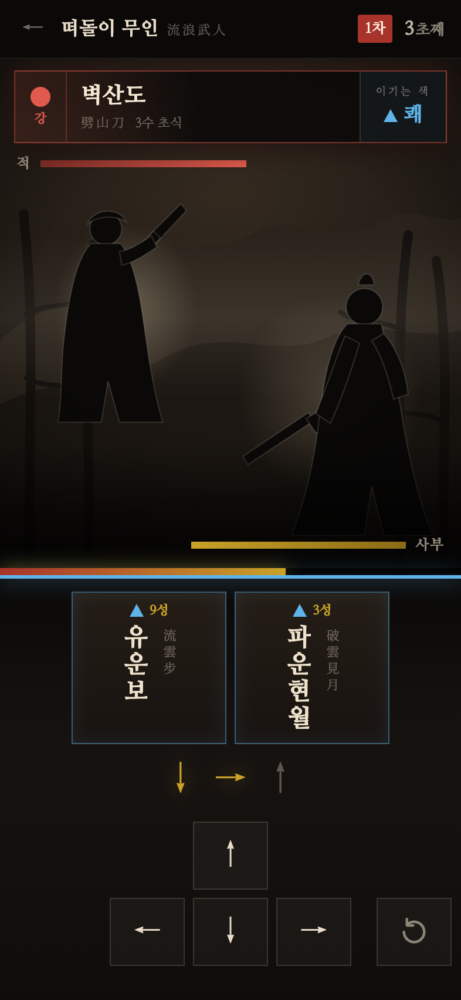
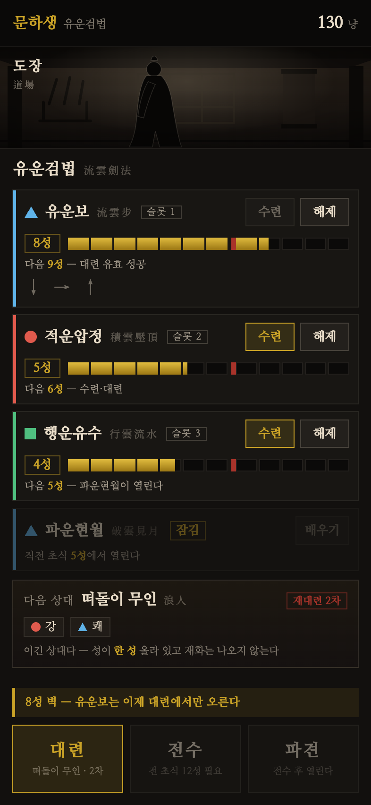
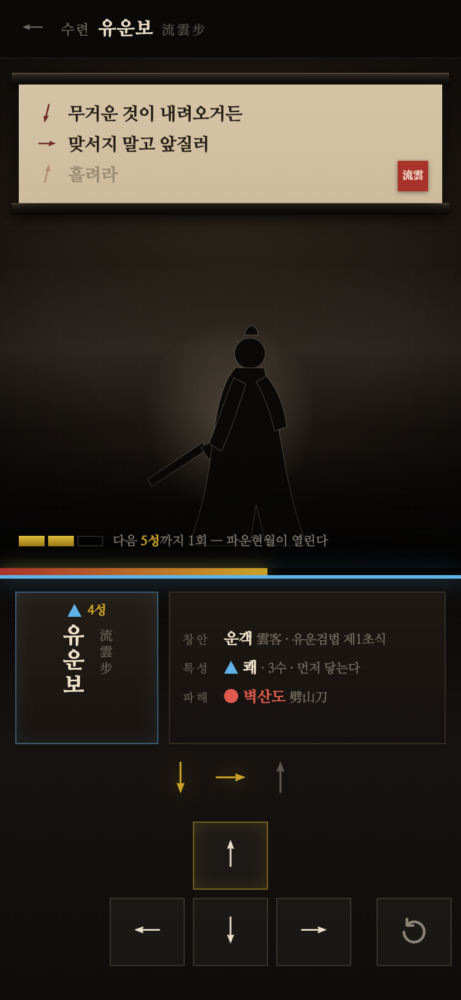
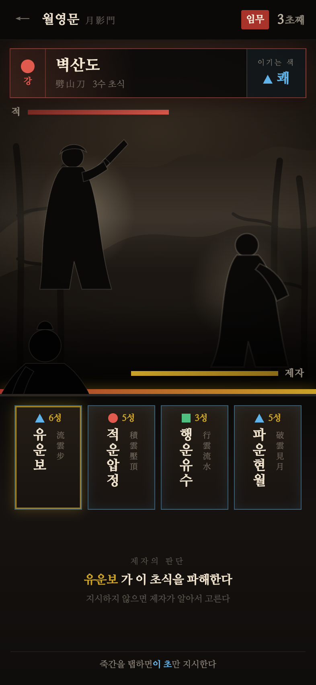
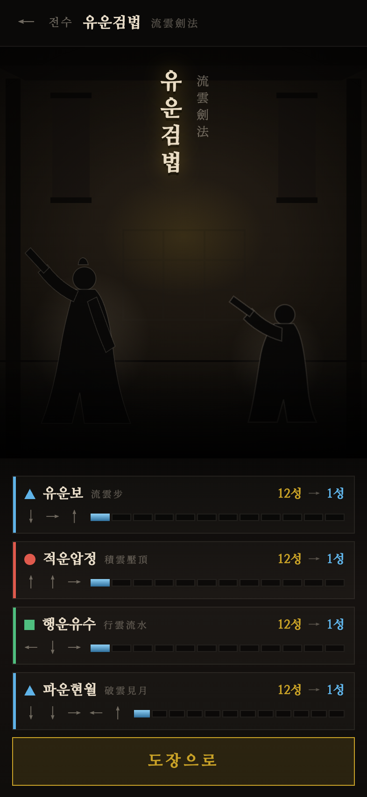
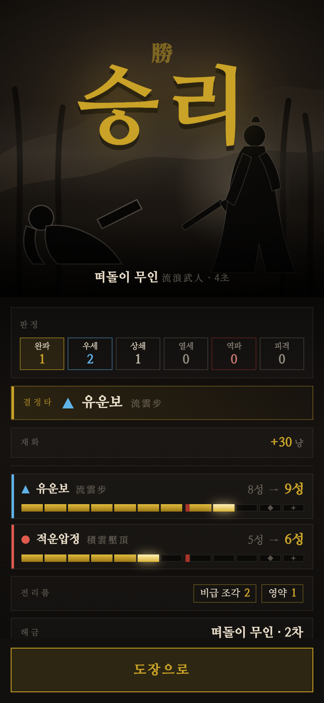
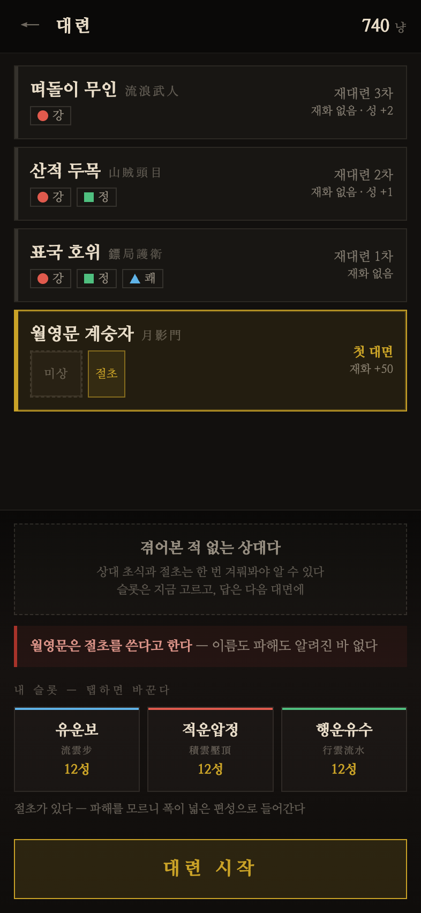

# 화면 UI·아트 재설계 — UI·UX 결정 로그

## 배경 & 목적

현행 v2 빌드는 코어 루프(후보 필터 시퀀스 입력 · 6단 공방 판정 · 숙련 4단계 · 전수 · 파견)가 전부 동작하지만, 화면은 v0 시절의 다크 카드 리스트를 그대로 물려받은 **관리 대시보드 톤**이다. 제안서가 파는 것은 「손으로 익힌 초식이 자동화되는 순간」과 「당신이 익힌 만큼 제자가 대신 싸운다」인데, 화면에는 손맛도 강호의 공기도 사람 형상도 없다.

본 사이클의 목적은 **로직을 건드리지 않고 화면의 시각 언어를 무협으로 옮기는 것**이다. 판정·입력·성장 규칙은 `docs/design/1.01-프로토타입-v2/spec_프로토타입_v2_통합_PRD.md` 가 SoT 이며, 본 로그는 그 규칙이 **어떻게 보이는가**만 결정한다.

입력 자료:

- 현행 빌드 스크린샷 15종 — `docs/screenshots/` (#53, 393×852 스테이지 영역만 촬영)
- UI·그래픽 스타일 레퍼런스 조사 — `docs/research/2026-09-01_UI-아트-레퍼런스-조사.md` (#25/PR #26). 5축 조사 + 그래픽 스타일 후보 3안, 권고 = ① 먹 실루엣
- 아트 톤 결정 (운영자, 2026-09-01 대화) — **톤의 주인은 무협(팽팽·절제)**, 아이들 아케이드의 코지·둥글둥글 관습은 배제. 주 타깃 10~30대 남성 무협 팬. 본 로그의 § 횡단 결정 D-1 이 이 결정의 정식 기록처다
- 용어 SoT — `docs/design/glossary.md`

**스코프 (운영자 확정, 2026-09-01)**: 「스킨 + 아레나」. 팔레트·서체·한자 조판 재정의 + 6단 판정 다중 부호화 + 게임필 3종 + 대련/파견 화면의 빈 공간을 아레나(배경 레이어 + 먹 실루엣 2인)로 채우는 데까지. 캐릭터는 **정지 실루엣**까지 확정하고 프레임 애니메이션은 § 잔여 논의로 남긴다. 리서치 § 8 의 권고 순서 (a) 팔레트·조판 + juice → (b) 아레나 배경 → (c) 캐릭터 애니메이션 중 (a)(b) 구간에 해당하며, 둘 다 에셋 생성과 병렬 착수가 가능한 구간이다.

**스코프 밖**: 정보 구조·화면 전환 흐름의 재설계(전면 재설계안은 M1 통합 PRD 가 `build착수` 상태라 파일 스코프가 크게 겹쳐 기각), 사운드(M3), 로컬라이즈(M3), 접근성 옵션 UI 노출(M3 — 단 색 이외 부호화는 본 사이클에서 이미 다룬다).

### 작업 방식

- **viewport**: 393×852 (repo 의 `#stage` 논리 해상도 — iPhone SE 기본값 대신 이 프로젝트의 실제 스테이지를 따른다)
- **캡처 파이프라인**: Chrome headless `--window-size=393,852 --force-device-scale-factor=2 --virtual-time-budget=8000`, `?capture=1` 로 아트보드 (0,0) 고정. 화면당 클린본 + 주석본 2벌
- **목업 위치**: `docs/design/1.02-화면-UI-아트-재설계/mockups/` (HTML · `assets/` 실물 에셋), 시안 PNG 는 결정 로그와 같은 폴더

## 화면 인벤토리 & 흐름

| # | 화면 | 역할 | 우선순위 | 현행 스크린샷 |
|---|---|---|---|---|
| S1 | 대련 | 사부가 직접 치는 실전. 캐릭터·배경·6단 판정 이펙트가 모두 모이는 화면 — **나머지 4화면이 여기서 시각 언어를 상속한다** | 1 | `06`, `07` |
| S2 | 도장 | 홈. 무공·초식 목록, 숙련/성 게이지, 하단 액션 바(대련·전수·파견) | 2 | `01`, `05`, `09`, `10` |
| S3 | 수련 | 「손으로 익힌다」의 본체. 구결 · 후보 필터 진행 · 방향 입력 | 3 | `02`, `03`, `04` |
| S4 | 파견 관전 | 제자가 대신 싸우는 것을 지켜보는 화면 + 선택적 지시. 감정적 정점 | 4 | `12`, `13`, `14` |
| S5 | 전수 | 사부 → 제자로 무공이 복사되는 순간 | 5 | `11` |
| S6 | 결과 | 승/패 정산 (대련·파견 공용) | 6 | `08`, `15` |
| S7 | 도전자 선택 | A-1~A-4 + 재대련 목록(회차·강화) + 절초 파해 공개 + 슬롯 in-place 교체. **S2 v2 에서 신설** — 홈이 목록을 감당하지 못해 분리됐다 | 3 | (현행 빌드 없음 — 신규 설계) |

흐름: `도장 ⇄ 수련` · `도장 → 대련 → 결과 → 도장` · `도장 → 전수 → 도장` · `도장 → 도전자 예고 → 파견 관전 → 결과 → 도장`.

S1 을 먼저 확정한 뒤 그 팔레트·서체·부호화 체계를 S2~S6 에 전개한다.

## 진단 — 현행 빌드 (스크린샷 15종, 2026-09-01)

> **한 줄 요약: 무협 도장에서 초식을 손으로 익히는 게임인데, 화면은 「초식 관리 스프레드시트」다.** 유일하게 게임처럼 보이는 순간은 완파의 「破」 오버레이 하나뿐이고, 그것이 방향이 맞다는 증거다.

| 축 | 진단 |
|---|---|
| **레이아웃** | 대련·파견(`06`/`13`)은 세로 공간의 **60~70%가 빈 검정**이다. 아레나가 있어야 할 자리가 비어 있고 정보는 위아래 가장자리로 밀려, 판정 오버레이가 맥락 없이 공중에 뜬 글자가 된다. 결과(`08`/`15`)는 보상의 정점인데 상단 ¼만 쓰고 나머지가 전부 공백. 반대로 도장(`09`)은 카드 4개 × 버튼 2개의 세로 스크롤 리스트 = 관리 화면 문법이다. 하단 3분할 액션 바는 구조가 옳지만 캡션이 작고 엄지 도달 범위를 활용하지 못한다 |
| **가독성** | 6단 판정 중 **완파만 표시**되어(#46 결정) 실질 「성공 / 무음」 2단으로 체감된다. 색·형태·위치·크기의 다중 부호화가 없다. 입력 진행 화살표(↓→↑)는 화면에서 **가장 중요한 피드백인데 가장 작은 12px 회색**이고, 진행 표시가 색 변화 하나뿐이다. 「이기는 색 ▲쾌」는 순간 판독이 아니라 읽어야 하는 문장. HP·게이지 3종이 상하 가장자리에 라벨 없이 색으로만 구분된다. **속성 3색 + 형태 병기(▲쾌/●강/■정)는 접근성 원칙을 이미 충족한 유일한 축이며 그대로 계승한다** |
| **정서** | 팔레트가 `#0e1116` 다크 대시보드 + 금색 액센트 — 장르와 무관한 시각 언어다(리서치 § 3-1 위반). 무협 기호(먹 번짐 · 붓질 · 여백 · 낙관 · 세로 조판)가 0. 한자 병기(`流雲劍法`·`劈山刀`)는 유일한 무협 신호인데 본문과 같은 산세리프 회색 보조 텍스트로 눌려 있어, **세계관 자산을 각주로 쓰고 있다**. 캐릭터·배경이 전무해 사부도 제자도 도전자도 텍스트 이름뿐 — 「제자가 대신 싸운다」의 감정 정점인 전수·파견(`11`/`13`)에 사람 형상이 없다. 디버그 컨트롤(응수 창 ×1.3 체크박스)이 게임 UI 최상단에 상주한다 |
| **자산** | 이미지 에셋 **0** — 전부 CSS 도형 + 유니코드 화살표. 폰트 1종(시스템 산세리프)이라 한자·한글·숫자가 모두 같은 서체로 조판되어 위계가 굵기/크기로만 만들어진다 |

## S1 대련 — 재설계 결정 (채택 v5)

입력 진행 상태(↓→ 까지 입력, 후보 4 → 2). 나머지 상태 시안 — 예고 `duel_v5_telegraph.png` · 확정 `duel_v5_narrow.png` · 완파 `duel_v4_crush.png` · 역파 `duel_v3_reversal.png` · 주석본 `duel_v3_input_annotated.png`. 목업은 `mockups/duel_v5.html` 이며 `?state=telegraph|input|narrow|crush|advantage|clash|disadvantage|reversal|hit` 로 9상태를 전환한다.

라운드 이력 — v1 한자 주역 안 · **v2 아레나·6단 판정 확정** · v3 죽간 성 표시 · v4 죽간 가변 · **v5 한자 우측 세로열(채택)**. 중간 목업·PNG 는 보존한다.

### v3~v5 추가 결정 (성 축 재설계 반영 라운드)

| 축 | 무엇을 | 왜 |
|---|---|---|
| **가독성** | **죽간에 성 배지(E11-3)** — 속성 기호와 같은 행 | 위력이 `powerOf(성)` 이라 속성과 성이 한 쌍으로 위력을 정한다(REQ-721). 둘을 갈라 두면 「지금 이걸 치면 얼마나 세나」를 두 곳에서 읽어야 한다. 탈락 죽간의 성은 회색으로 죽어, 살아있는 후보의 성만 금색으로 남는다 |
| | **죽간을 후보 수만큼 그리는 가변으로**(최대 4매, 중앙 정렬) — 4매 84px → 2매 132 → **1매 172 + 금테 확대** | 고정 슬롯 + 빈칸으로는 **REQ-110**(「후보 1개 도달 시 중앙 확대 + 이름 표시」)이 성립하지 않는다. 개수 감소 자체가 「좁혀진다」의 표현이 되고, 1매 = 확정이 화면에서 가장 큰 사건이 된다 |
| **정서** | **한자를 한글 아래가 아니라 우측 세로열로**(E11-4) — 한글 세로줄 옆에 한자 세로줄 | 세로 조판에서 한자 병기의 제자리는 아래가 아니라 옆이다. 아래에 두면 각주로 읽히고, 옆에 두면 같은 이름의 두 표기로 읽힌다 — D-2 의 「보조 병기」가 조판으로 성립하는 형태. 죽간 폭을 넓힌 목적이 이것이다 |

### 축별 결정

| 축 | 무엇을 | 왜 |
|---|---|---|
| **레이아웃** | 빈 검정 60~70% 를 **아레나(E2)** 로 전환 — 원경 산(E2-1) · 중경 대나무(E2-2) · 안개(E2-3) · 비네트 · 지면의 레이어 스택 위에 먹 실루엣 2인(E3/E4)을 대각 대치로 배치. 상단 띠 50 / 아레나 440 / 입력부 362 의 3단 고정 | 현행의 빈 공간은 여백이 아니라 **결손**이었다. 판정 오버레이가 맥락 없이 공중에 뜨던 원인이 아레나 부재이므로, 판정이 착지할 무대를 먼저 만든다 |
| | **상대 예고(E5)를 아레나 최상단 가로 스트립으로 고정** | 예고를 화면 중앙에 두면 판정 오버레이와 정면충돌한다(v1 첫 캡처에서 실증). 판정이 쓸 중앙을 비워두는 것이 예고 위치의 결정 근거다 |
| | 방향 키패드(E13)를 **화면 정중앙**, 되돌리기(E14)를 **우측 끝 · 오른쪽 화살표와 같은 행·같은 크기(64×58)** 로 분리 (키 간격 7px ↔ 되돌리기까지 21px) | 오조작 비용이 정반대인 두 조작을 한 flex 행에 묶으면 키패드가 중앙에서 밀린다. 간격 3배가 별개 그룹의 신호 |
| **가독성** | **6단 판정 전부를 4중 부호화로 표시** — 위치(위=적이 맞음 / 중앙=상쇄 / 아래=내가 맞음) · 크기(완파·역파 96px > 우세·열세 66 > 상쇄 54, 피격 80) · 색(금·청 / 회 / 적) · 형태(글자 자형). 완파 ↔ 역파는 **상하 대칭** | 6단계를 색만으로 구분하면 순간 판독이 실패하고 색각 접근성도 무너진다(리서치 축 E). 의미가 정반대인 쌍을 시각적으로 대칭 배치해 위치 자체가 승패를 말하게 한다. 현행 「완파만 표시」는 실질 2단으로 체감되던 것을 6단으로 되돌린 것이다 — #46 의 비대칭화는 **수련 화면(성공/실패 2단)** 결정이고 대련의 6단과는 별개 축이다 |
| | 후보 필터를 **죽간 4매(E11) 상시 표시** — 탈락은 먹이 번지듯 흐려지며 가라앉고(`.out`), 확정 1매는 금테 + 확대(`.only`) | 「키를 칠수록 후보가 좁혀진다」가 코어 재미인데 현행은 남은 1개만 보여줘 **좁혀지는 과정 자체가 화면에 없었다**. 탈락을 삭제가 아니라 침강으로 표현해야 필터링이 보인다 |
| | 진행형 후보 색(E10)을 입력부 상단 전폭 발광 띠로 승격, 입력 트레일(E12) 12px → 28px | 「지금 내 색」과 「몇 번째 글자를 받고 있는가」가 화면에서 가장 중요한 피드백인데 가장 작았다 |
| | 응수 창(E8)을 아레나 하단 가장자리 전폭 게이지로 분리 | 시간 압박은 아레나에 속한 정보지 입력부에 속한 정보가 아니다. 아레나 바닥을 가로지르게 두면 실루엣을 보는 동안 주변시로 읽힌다 |
| **정서** | 팔레트를 청먹 `#0e1116` → **갈먹 C1 `#12100e`** + 화선지 C3 + 금 C4 + 주사 낙관 C5, 속성 3색(C6/C7/C8)은 계승 | 다크 대시보드 톤을 벗기는 최소 지렛대가 팔레트다. 청먹은 IT 대시보드의 색이고 갈먹은 지물의 색이다. 속성 3색은 형태 병기(▲●■)까지 이미 갖춘 현행의 유일한 성공 자산이라 손대지 않는다 |
| | 서체를 시스템 산세리프 → **명조 단일 계열**(F1 나눔명조 + F2 한자 서브셋) | 서체는 팔레트 다음으로 싼 세계관 지렛대다. 명조의 붓 기원 획이 무협 기호의 대부분을 대신한다 |
| | **한글 주 / 한자 보조** — 횡단 결정 D-2 를 이 화면에서 8곳 적용(차수 낙관 · 초 카운터 · 상대 속성 · 상대 초식명 · 이기는 색 · 기력 라벨 2 · 판정 · 죽간 초식명) | D-2 참조. 한자 병기는 전부 `.hj` 클래스 한 곳으로 통일해, 나머지 화면 전개와 「한자 전면 제거」가 모두 한 규칙 변경으로 닫히게 했다 |
| **자산** | 실루엣 뒤 **역광**(radial glow) 도입 | 먹 실루엣은 어두운 배경에서 그대로 사라진다. Punch Club 의 「모든 오브젝트에 아웃라인, 오브젝트보다 어둡게」를 역방향(밝은 림)으로 적용한 것 — 대상이 배경보다 어두울 때의 같은 규칙 |
| | 되돌리기 아이콘을 **실파일 SVG**(`mockups/assets/reset.svg`)로 | 게임 엔진은 폰트 아이콘 글리프를 그대로 렌더하지 못하고, 파일이어야 후속 아트 교체가 스왑으로 끝난다 |
| | juice 3종 — 화면 흔들림(`.shake-hard`, 완파·역파 한정) · 히트 플래시(`.fig.flash`) · 피해 비네트(`.hurt`) | 투입 대비 체감이 가장 큰 순서 그대로(리서치 § 7-3). 히트스톱은 정지 시안으로 검증 불가라 § 잔여 논의 |

### 추가 결정

- **흔들림은 완파·역파에만 건다.** 6수마다 흔들리면 흔들림이 정보를 잃는다 — 크기 축과 같은 극단 2등급에만 배정해 부호화 축을 하나 더 만든다.
- **디버그 컨트롤(응수 창 ×1.3 체크박스)은 스테이지 밖으로 뺀다.** 현행은 게임 UI 최상단에 상주해 첫인상을 지배한다. 접근성 옵션으로서의 응수 창 조정은 M3 설정 화면 몫이고, 개발용 토글은 게임 화면에 두지 않는다.
- **캡처 파이프라인 버그 1건 (2026-09-02 수정)** — `body.ui-capture` 에 `padding:0` 이 빠져 있어 S1 v3~v5·S4 v1 의 초기 캡처가 24px 아래로 밀려 찍히고 하단 24px 이 잘렸다. 레이아웃 문제로 오인해 요소 높이를 줄일 뻔했다 — **시안이 잘리면 레이아웃보다 캡처 설정을 먼저 의심할 것.** 목업 4종 모두 수정·재촬영했다.
- **실루엣 SVG 는 플레이스홀더다.** 본 시안의 E3/E4 는 손으로 그린 검증용이며, 특히 E4 사부의 두상·상투·도포 비율은 최종 품질이 아니다. 확정한 것은 **「먹 실루엣 노선이 이 화면에서 성립한다」**는 사실이지 이 형상이 아니다 — 교체는 § 후속 작업.

### 요소 인벤토리 (확정 시안 `data-ui` 원장 전사)

| ID | 이름 | ID | 이름 |
|---|---|---|---|
| E1 | 상단 띠 — 도전자 표찰 | E7 | 사부 기력 |
| E1-1 | 물러나기 | E8 | 응수 창 게이지 |
| E1-2 | 도전자 이름 | E9 | 판정 오버레이 |
| E1-3 | 차수 낙관 | E9-1 | 판정 한글 |
| E1-4 | 초 카운터 | E9-2 | 판정 한자 (보조) |
| E2 | 아레나 | E10 | 진행형 후보 색 |
| E2-1 | 원경 산 레이어 | E11 | 후보 죽간 |
| E2-2 | 중경 대나무 레이어 | E11-1 | 죽간 속성 기호 |
| E2-3 | 안개 층 | E11-2 | 죽간 초식명 |
| E3 | 도전자 실루엣 | E12 | 입력 트레일 |
| E4 | 사부 실루엣 | E13 | 방향 키패드 |
| E5 | 상대 예고 | E13-1 | 키캡 |
| E5-1 | 상대 속성 | E14 | 입력 되돌리기 |
| E5-2 | 상대 초식명 | | |
| E5-3 | 이기는 색 | | |
| E6 | 도전자 기력 | | |

## S2 도장 — 재설계 결정 (채택 v2)

성장 중(유운보 8성 벽 · 파운현월 잠김). 전수 후 상태 시안 — `dojo_v2_disciple.png` · 주석본 `dojo_v2_growth_annotated.png`. 목업은 `mockups/dojo_v2.html` 이며 `?state=growth|disciple` 로 2상태를 전환한다(v1 = `mockups/dojo_v1.html`, 숙련도 축 안 — 라운드 이력으로 보존).

> 2026-09-02 재개. 보류 사유였던 성(成) 스펙 개정이 `docs/design/1.03-성-초식-단위-재설계/spec_성_축_초식_단위_재설계.md` 로 확정되고 구현(#64·#65·#66)까지 main 에 들어와, v1 의 잠정 결정 중 성 축에 매여 있던 4요소(입문 배지 · 무공 성 게이지 · 성 상태 라벨 · 상단 단계 표기)를 전부 다시 그렸다.

### 축별 결정

| 축 | 무엇을 | 왜 |
|---|---|---|
| **가독성** | **성 게이지(E4-10)를 연속 막대 + 계단 눈금 12 로** — 지난 칸은 금색 충전, 현재 칸만 부분 채움. **8성 벽은 7↔8 사이 주사색 세로선**, **11칸 `◆`(결정타) · 12칸 `✦`(완파)** 로 형태를 달리한다 | REQ-707 의 요구 그대로다. 성 계단은 구간마다 **적립 수단이 바뀌는** 규칙(수련→대련→결정타→완파)이고, 그 규칙이 게이지 밖 설명문에만 있으면 화면은 다시 숫자만 남는다. 색이 아니라 위치·형태로 부호화해 S1 의 다중 부호화 원칙과 같은 계열로 묶었다 |
| | **다음 계단 안내(E4-11)를 게이지 아래 한 줄로** — 「다음 9성 — 대련 유효 성공」 · 「다음 5성 — 파운현월이 열린다」 · 「다음 8성 — 수련은 여기까지, 대련으로만」(주사색) | v1 이 찾아낸 **최대 결손**(「다음에 무엇이 열리는지 알 수 없다」)의 직접 해소다. v1 의 잠정 결정이던 숙련 4단계 라벨은 숙련도 개념 소멸로 근거를 잃었고, 그 자리를 성 계단이 그대로 받는다 — 결손 진단은 유효했고 축만 갈렸다 |
| **레이아웃** | **만성(12성)·잠김 행은 게이지를 접고 성 배지만 남긴다.** 12성 행은 「수련」 버튼도 제거 | 12칸 전부 금색 / 전부 빈 칸은 정보량이 0인데 세로를 행마다 40px 먹는다. 접어서 회수한 세로가 정확히 제자 블록이 들어갈 자리다 — 「성장이 끝난 초식이 줄어들고 그 자리를 제자가 받는다」가 화면 구조로 성립한다 |
| | **무공 카드(E3)의 크롬을 벗겨 머리글 한 줄로** | v1 진단 「행마다 테두리+배경+색띠가 다 있어 4행이 4개의 독립 패널로 보인다」의 한 층 위 문제. 목록을 감싼 카드가 목록을 또 하나의 패널로 만든다 |
| | **정경 배너(E2) 136 → 108px** | 성 축이 화면에 실리면서 세로 예산이 재분배됐다. 정경의 존재감이 그만큼 줄어드는 것은 감수한 비용이다 |
| | **다음 상대(E10) 신설 — 도전자 1건 요약만 홈에.** 이긴 도전자 전체 목록은 **S7 도전자 선택 화면으로 분리** | 현행 빌드는 재대련 목록을 홈에 통째로 박아 12성 4행에 밀려 잘렸다(스크린샷 `09`/`10` 에서 실증 — 카드 본문이 툴팁에 덮이고 아래가 사라진다). **목록은 그 행동의 진입 화면에 속하지 홈에 속하지 않는다** — 홈은 「지금 무엇을 할 수 있나」의 요약이다 |
| | **제자 블록(E9) 신설** — 수련 지정 · 진척 막대 · 남은 시간 · 초식별 성 4열. 제자 실루엣(E2-3)은 정경에 그대로 둔다 | REQ-752. v1 이 은퇴시킨 「제자 카드」의 부활이 아니라 **역할 분리**다 — 존재·정서는 정경이, 조작·수치는 블록이 맡는다. v1 이 카드를 뺀 이유(스크롤 밖으로 밀림)는 만성 행 압축으로 해소됐다 |
| **정서** | 재화 표기 `元` → **`냥`** (D-3), 상단 띠 · 액션 캡션 전 표면 | D-3 참조 |
| | 뒤처진 축을 **주사색(C5)으로 통일** — 8성 벽 · 제자의 미달 초식 · 파견 잠금 버튼 · 경고 툴팁 | C5 는 v1 에서 낙관용으로만 선언되고 쓰이지 않던 색이다. 「여기서 막혔다」를 한 색으로 묶으면 화면 세 곳의 잠금이 같은 언어로 읽힌다 |
| **자산** | 신규 아트 0 — 성 게이지·계단 눈금·속성 기호 전부 CSS 도형. 정경 SVG 는 v1 을 108px 로 재단해 승계 | REQ-707 의 「신규 아트 비용 0」 계약. 실루엣 교체는 § 후속 작업의 AI 생성 항목에서 S1 과 함께 처리한다 |

### 추가 결정

- **절초 파해 대상을 홈에서 미리 공개한다(E10-4).** REQ-732 는 도전자 예고 화면의 요구지만, 「다음 상대」가 홈에 있는 이상 여기서도 같은 정보가 읽혀야 한다 — 답을 두 화면에서 다르게 주면 예고 화면이 함정이 된다.
- **파견 잠금은 버튼에서 이유까지 읽힌다(E7).** 「행운유수 3성 · 권장 5성」 — REQ-743 이 팝업이 아니라 하드 잠금인 이유가 「실패를 고를 경로를 남기지 않는다」이므로, 잠금이 왜 걸렸는지도 같은 자리에서 끝나야 한다.
- **E# 는 재번호하지 않았다.** 성 축 소멸로 은퇴한 것 — `E3-2` 입문 배지 · `E3-3` 무공 성 게이지 · `E3-4` 성 상태 라벨 · `E4-5` 숙련 게이지 · `E4-6` 숙련 단계. 신규는 `E4-10`~`E4-12` · `E9` · `E10` 으로 이어 붙였다.
- **수련 시뮬(E8)을 스테이지 밖으로 뺀다.** 디버그 컨트롤과 같은 판단 — 밸런스 측정 도구가 게임 화면의 세로를 먹을 이유가 없다. REQ-781 치트 패널과 같은 자리로 간다.
- **초식 행 아코디언(#37)을 철회한다 — 행은 항상 한 형태다.** 도입 근거였던 「4행을 다 펼칠 세로가 없다」는 성 게이지·안내문이 접힘과 무관하게 항상 그려지게 되면서 소멸했고, 펼침이 더하는 것은 시퀀스 화살표 줄(E4-9) 하나뿐이었다. 그 한 줄은 도장에서 없앤다 — 시퀀스는 수련(구결 족자)에서 익히고 대련에서는 딜레이드 힌트(REQ-712)가 알려주므로, 「손으로 익힌 초식」이 주제인 게임의 홈에 정답표를 둘 이유가 없다. 이름 앞 ▶/▼ 토글이 사라져 속성 기호가 행의 첫 요소가 되고 4행의 정렬이 한 축에 선다. 다만 만성(12성)은 REQ-831 이 수련 버튼을 없애므로 **만성이면서 미장착인 초식에는 시퀀스 참조처가 남지 않는다** — 그 국면의 처분은 별도 안건이다. 운영자 판단 2026-09-03.
- **다음 상대 요약(E10)을 철회한다 — 도전자 정보의 자리는 S7 하나다.** 위 「다음 상대(E10) 신설」과 「절초 파해 대상을 홈에서 미리 공개한다(E10-4)」를 대체한다. 하단 밴드의 「대련」이 S7 도전자 선택 화면을 별도 메뉴로 열게 되면서, 홈 요약과 S7 이 한 탭 거리에서 같은 `challengerEntry` 를 읽어 같은 정보를 두 번 말하게 됐다 — E10-4 의 근거였던 「홈에도 같은 공개 층이 읽혀야 한다」는 홈에 도전자가 없으면 성립하지 않는다. 제자 블록(E9)은 그대로 둔다: 전수 전 블록의 안내문이 전수 조건을 온전히 설명하는 자리라, 하단 「전수」 버튼 부제와 겹치는 비용보다 낫다. 운영자 판단 2026-09-03.

### 요소 인벤토리 (확정 시안 `data-ui` 원장 전사)

| ID | 이름 | ID | 이름 |
|---|---|---|---|
| E1 | 상단 띠 | E4-10 | 성 게이지 |
| E1-1 | 단계 표기 | E4-11 | 다음 계단 |
| E1-2 | 재화 | E4-12 | 성 배지 |
| E2 | 도장 정경 | E6 | 유도 툴팁 |
| E2-1 | 도장 내부 레이어 | E7 | 하단 액션 바 |
| E2-2 | 사부 실루엣 | E7-1 | 액션 버튼 |
| E2-3 | 제자 실루엣 | E7-2 | 액션 캡션 |
| E2-4 | 도장 현판 | E9 | 제자 블록 |
| E2-5 | 제자 상태 | E9-1 | 수련 지정 |
| E3 | 무공 머리글 | E9-2 | 수련 진척 |
| E3-1 | 무공명 | E9-3 | 초식별 성 |
| E4 | 초식 목록 | E9-4 | 수련 중 초식 |
| E4-1 | 초식 행 | | |
| E4-2 | 속성 기호 | | |
| E4-3 | 초식명 | | |
| E4-4 | 슬롯 배지 | | |
| E4-7 | 수련 버튼 | | |
| E4-8 | 장착·해제 | | |

**은퇴 (재사용 없음)**: E3-2 입문 배지 · E3-3 무공 성 게이지 · E3-4 성 상태 · E4-5 숙련 게이지 · E4-6 숙련 단계 · E5 제자 카드(v1 에서 은퇴) · E8 수련 시뮬(스테이지 밖으로) · **E4-9 시퀀스 (펼침)**(아코디언 철회로 소멸 — § 추가 결정) · **E10 다음 상대 (E10-1~4 포함)**(홈 요약 철회로 소멸 — § 추가 결정). 이 표는 v2 목업 전사이나 E4-9 · E10 계열은 예외다 — 목업은 철회 이전 산물이라 그 줄을 아직 그린다.

## S3 수련 — 재설계 결정 (채택 v4)

입력 진행 상태(↓→ 까지 입력, 남은 구결 1구). 성공 시안 `train_v4_success.png` · 주석본 `train_v3_input_annotated.png`. 목업은 `mockups/train_v4.html` 이며 `?state=input|success` 로 전환한다. 라운드 이력 — v1 초판 · v2 구결 기능화 · v3 초식 해설 · **v4 한자 우측 세로열(채택)**.

> **한 줄 요약: 손으로 익히는 화면인데, 정작 실전에서 쓸 화면과 닮지 않았다.** 현행은 세로의 40%가 빈 검정이고 진행 화살표 12px·후보 1개·좌측 정렬 키패드라, 실전(죽간·28px 트레일·중앙 키패드)과 **손의 좌표가 다르다**. 수련의 목적이 실전 전이인데 시각 언어부터 전이가 끊긴다.

### 축별 결정

| 축 | 무엇을 | 왜 |
|---|---|---|
| **레이아웃** | **실전과 같은 3단 고정** — 상단 띠 50 / 수련장 440 / 입력부 362. 입력부는 픽셀 단위로 대련과 같다 | 수련은 「실전과 동일한 창」(REQ-715)인데 화면 좌표가 다르면 익힌 손이 옮겨가지 않는다. 전이를 만드는 것은 규칙의 동일함이 아니라 **좌표의 동일함**이다 |
| | 족자와 실루엣 사이 여백을 **남긴다** | 초식 중에는 도약·상하 대형 휘두름이 있을 수 있어 실루엣 위 공간이 동작 예산이다 (운영자 판단 2026-09-02). S1 진단의 「빈 공간 = 결손」은 정보가 들어갈 자리에 대한 것이고, 여기는 동작이 들어갈 자리다 |
| **가독성** | **구결 족자(E4)를 장식에서 기능으로** — 3구절이 `↓ → ↑` 한 방향씩에 1:1 대응하고, 친 만큼 점등·남은 구절은 흐려진다 | 현행 구결은 파란 테두리에 갇힌 UI 문구였다. 구결이 곧 시퀀스라는 것을 화면이 말하지 않으면 「구결을 외워 친다」가 설명 텍스트로만 남는다. 딜레이드 힌트(REQ-712, 수련은 0)가 이 점등으로 구현된다 |
| | 족자는 **3줄 고정 창**이고 지금 칠 구절이 둘째 줄에 고정, 입력마다 한 줄 올라가며 **직전 구절만 점등** — 위 「친 만큼 점등·남은 구절은 흐려진다」를 대체한다 | 족자 높이가 구절 수에 매여 있으면 4·5수 초식에서 사부 머리를 덮는다 — 실측(2026-09-03, 393×852)으로는 3수에서 이미 알파 경계를 14px 침범했고 5수에서는 75px 였다. 창을 상수로 묶으면 어느 초식이든 같은 높이이고, 지금 칠 구절이 언제나 같은 자리라 눈이 그 줄을 찾지 않는다. 시퀀스 전체 조망은 키패드 위 트레일(E10)이 이미 지므로 점등을 한 줄로 줄여도 잃는 정보가 없다. **시안 `train_v4_input.png` 과의 차이** — 시안은 3구절을 모두 편 족자이고 창 개념이 없다 (운영자 안 2026-09-03) |
| | **죽간은 1매만** — 수련 대상 초식 | 수련에는 후보 필터가 없다. 대상이 하나인데 다른 초식을 후보처럼 늘어놓으면 「지금 무엇을 익히는가」가 흐려진다 (운영자 판단 2026-09-02) |
| | 비운 자리에 **초식 해설(E13)** — `창안 / 특성 / 파해` 3줄 | 파해 1:1 대응(REQ-731)은 지금까지 비급 구결 텍스트에만 있었다(REQ-207). 수련은 그 초식만 보는 유일한 화면이라 해설의 제자리다 |
| | 죽간 폭은 **대련 4매 폭**으로 고정하고, 해설은 「창안」만 접히고 「특성」·「파해」는 한 줄 + 말줄임 | 후보 계단이 없는 화면에서 1매 = 최대 폭은 아무 정보도 싣지 않는다. 그 폭을 해설에 넘기면 통제 불가능한 길이는 창안자 이름·유파명뿐이라, 그 줄만 접고 나머지는 3줄의 시선 리듬을 지킨다 (운영자 육안 2026-09-03) |
| | 수련 진척(E5)을 **3칸 계단 + 다음 성 안내**로 | REQ-702 의 「수련 3회 = 1성」이 정확히 3칸이다. S2 도장의 계단 언어를 상속해 세 화면이 같은 문법을 쓴다 |
| **정서** | **족자를 화면에서 유일하게 밝은 면으로** — C9 화선지 면 `#cdbb9c` 신설 + 상하 축 + 주사 낙관 | 화선지를 글자색으로만 쓰던 것을 처음 **표면**으로 썼다. 먹 화면에 종이 한 장이 걸리면 그것만으로 도장이 된다 |
| | 판정은 성공만 대형 「성공 / 成功」, 실패 무표시 | #46 비대칭 승계. 자리·조판은 실전 판정 오버레이와 동일 — 여기서도 전이가 목적이다 |
| **자산** | 신규 아트 0 — 족자·계단·해설 전부 CSS. 실루엣은 S1 사부 SVG 승계 | S1·S2 와 같은 계약 |

### 요소 인벤토리 (확정 시안 `data-ui` 원장 전사)

| ID | 이름 | ID | 이름 |
|---|---|---|---|
| E1 | 상단 띠 | E9 | 후보 죽간 |
| E1-1 | 물러나기 | E9-1 | 죽간 속성 기호 |
| E1-2 | 초식명 | E9-2 | 죽간 초식명 |
| E2 | 수련장 | E9-3 | 죽간 성 |
| E2-1 | 수련장 바닥 레이어 | E9-4 | 죽간 한자 (보조) |
| E2-2 | 안개 층 | E10 | 입력 트레일 |
| E3 | 사부 실루엣 | E11 | 방향 키패드 |
| E4 | 구결 족자 | E11-1 | 키캡 |
| E4-1 | 구결 구절 | E12 | 입력 되돌리기 |
| E4-2 | 낙관 | E13 | 초식 해설 |
| E5 | 수련 진척 | E13-1 | 창안 |
| E5-1 | 회차 계단 | E13-2 | 특성 |
| E5-2 | 다음 성 안내 | E13-3 | 파해 대상 |
| E6 | 응수 창 게이지 | E7 | 수련 판정 |
| E8 | 진행형 후보 색 | E7-1 / E7-2 | 판정 한글 / 한자 |

**은퇴 (재사용 없음)**: E1-3 상단 성 배지 — 죽간 성(E9-3)과 중복이고, 죽간 쪽이 대련과 같은 규약이라 그쪽을 남겼다.

## S4 파견 관전 — 재설계 결정 (채택 v1)

반짝임 상태(제자가 파해를 보유해 유도가 뜬 수). 나머지 시안 — 자동 선택 `dispatch_v1_auto.png` · 제자 완파 `dispatch_v1_crush.png` · 주석본 `dispatch_v1_auto_annotated.png`. 목업은 `mockups/dispatch_v1.html` 이며 `?state=beckon|auto|crush` 로 전환한다.

> **한 줄 요약: 「제자가 대신 싸운다」를 파는 화면인데, 제자가 없다.** 현행(`13`)은 세로의 65%가 빈 검정이고 제자도 상대도 형상이 없어, 감정의 정점이어야 할 화면이 초식 버튼 목록과 색 막대 두 개로 끝난다.

### 축별 결정

| 축 | 무엇을 | 왜 |
|---|---|---|
| **레이아웃** | **S1 아레나를 통째로 상속** — 레이어 스택·역광·비네트·기력 2·상대 예고·응수 창 전부 같은 좌표. 바뀌는 것은 **아레나에 서는 사람뿐**이다 (사부 → 제자) | 파견은 대련과 같은 판정 규칙을 돌린다(REQ-745). 규칙이 같은데 화면이 다르면 「내가 치던 그 싸움을 제자가 하고 있다」가 성립하지 않는다. 상속이 곧 서사다 |
| | **사부를 아레나 밖 앞 구석에 둔다(E15 지켜보는 사부)** — 화면 앞쪽에서 잘린 뒷모습 | 이 화면의 정서는 「손을 놓았다」다. 사부를 지우면 관객이 사라지고, 아레나에 넣으면 파견이 아니게 된다. 앞쪽에서 잘린 뒷모습이 **카메라가 곧 사부의 시선**임을 말한다 |
| | **키패드가 있던 자리를 비운다** — S1 에서 손이 있던 362px 하단의 십자·되돌리기가 여기엔 없다 | 빈자리가 결손이 아니라 **의미**인 유일한 화면이다. 그 자리를 다른 조작으로 메우면 「손 놓고 보는 것」(REQ-407 관전 기본)이 사라진다 |
| **가독성** | 비운 손자리에 **제자의 판단(E12)** — 「우세를 골랐다 — 유운보 ▲」 + 지난 수 한 줄 | 자동 선택(REQ-403: 우세 → 상쇄 → 역파 회피)은 규칙이 있는데 화면엔 결과만 나왔다. **왜 그걸 골랐는지**가 보이지 않으면 관전은 그냥 대기다. 관전의 콘텐츠는 제자의 판단 그 자체다 |
| | **반짝임(E11 `.beckon`)을 금색 펄스로** — 파란 글로우였던 것을 유도 전용 색으로 분리 | 현행은 반짝임이 선택 상태와 같은 파란색이라 「유도」로 읽히지 않았다(스크린샷 `13` 에서 두 개가 동시에 빛난다). 금색은 이 프로젝트에서 「달성·확정」의 색이고, 유도는 그 예고다 |
| | 제자 초식에 **성 배지(E11-3) + 한자 우측열(E11-4)** — S1 죽간과 동일 규약 | 정작 싸우는 화면에 제자의 초식별 성이 없었다. 도장(S2)에서 키운 값이 여기서 읽혀야 수련의 보상이 닫힌다 |
| | 기력 라벨을 `적` / **`제자`** 로 | 색 그라디언트만으로 누가 누구인지 구분하던 것을 라벨로 못박는다 |
| | 상단 띠를 **임무 표찰**로 — `B-2` 낙관 + 임무 상대 + 수 카운터 | 파견 2단화(REQ-742) 이후 B-1 고정과 B-2+ 랜덤 임무는 성격이 다른 판이다. 어느 단계인지가 화면에 없으면 랜덤 조합이 그냥 변덕으로 보인다 |
| **정서** | 지시 안내(E13)를 화면 바닥 한 줄로 — 「죽간을 탭하면 이 수만 지시한다 · 남은 2.5초」 | 「관전 — 지시는 선택이다」가 현행에선 상단 회색 각주였다. 선택이라는 사실은 바닥에 조용히 있어야 관전을 재촉하지 않는다(REQ-407 알림·재촉·타이머 없음) |
| **자산** | 신규 아트 0 — 제자 실루엣은 S2 정경 SVG, 관전 사부는 신규 뒷모습 SVG(코드 렌더) | S1~S3 과 같은 계약 |

### 요소 인벤토리 (확정 시안 `data-ui` 원장 전사)

| ID | 이름 | ID | 이름 |
|---|---|---|---|
| E1 | 상단 띠 — 임무 표찰 | E7 | 제자 기력 |
| E1-1 | 물러나기 | E8 | 응수 창 게이지 |
| E1-2 | 임무 상대 | E9 | 판정 오버레이 |
| E1-3 | 임무 낙관 | E9-1 / E9-2 | 판정 한글 / 한자 |
| E1-4 | 초 카운터 | E10 | 제자 색 띠 |
| E2 | 아레나 | E11 | 제자 초식 |
| E2-1 | 원경 산 레이어 | E11-1 | 죽간 속성 기호 |
| E2-2 | 중경 대나무 레이어 | E11-2 | 죽간 초식명 |
| E2-3 | 안개 층 | E11-3 | 죽간 성 |
| E3 | 도전자 실루엣 | E11-4 | 죽간 한자 (보조) |
| E4 | 제자 실루엣 | E12 | 제자의 판단 |
| E5 | 상대 예고 | E13 | 지시 안내 |
| E5-1~3 | 상대 속성 / 초식명 / 이기는 색 | E15 | 지켜보는 사부 |
| E6 | 도전자 기력 | | |

**미사용 (S1 에서 상속했으나 이 화면엔 없음)**: 방향 키패드 · 입력 되돌리기 · 입력 트레일 — 파견에는 입력이 없다.

## S5 전수 — 재설계 결정 (채택 v2)

자세가 맞아떨어진 순간(전수 완료). 따라 하는 중 시안 `transmit_v2_follow.png` · 주석본 `transmit_v2_done_annotated.png`. 목업은 `mockups/transmit_v2.html` 이며 `?state=follow|done` 으로 전환한다. 라운드 이력 — v1 전수 광선 + 복사 안내 + 단계 승급 안(기각) · **v2 시범·따라 하기(채택)**.

> **한 줄 요약: 무공이 사람에게서 사람에게로 건너가는 순간인데, 화면은 폴더 두 개를 나란히 놓은 파일 복사 창이다.** 현행(`11`)은 사부 컬럼과 제자 컬럼에 같은 초식 목록을 두 번 그린 diff 뷰이고, 세로 45%가 비어 있으며 사람이 없다.

### 축별 결정

| 축 | 무엇을 | 왜 |
|---|---|---|
| **정서** | **사부가 초식을 시범하고 제자가 그것을 따라 한다**(E3·E4·E11) — 둘 다 같은 방향을 보고, 제자는 사부의 등 뒤에서 같은 자세를 잡는다. `follow` 상태에서 제자의 팔은 아직 34° 어긋나 있고, `done` 에서 사부와 나란해진다 | **v1 의 전수 광선을 기각한 자리다.** 광선은 「데이터가 전송된다」는 은유라 이 게임이 파는 사제 관계와 어긋난다. 무공이 넘어가는 실제 그림은 **보고 따라 하는 것**이고, 그것이 이 게임의 코어(손으로 익힌다)와도 같은 동작이다. 자세의 어긋남 → 일치가 전수의 전후를 말한다. 운영자 판단 2026-09-02 |
| | 도장 안, 광휘는 절제 — 화면에서 빛나는 것은 무공 인장 하나 | v1 첫 캡처에서 헤일로가 도장 전체를 노랗게 띄워 먹 톤이 사라졌다 — D-1(팽팽·절제) 위반. 무협의 빛은 넓게 퍼지지 않는다 |
| | **무공 인장(E6)** — 무공명을 세로 조판으로 두 사람 위에 세운다 (한자 우측 세로열, D-2) | 건너가는 것은 초식 4개가 아니라 **무공 하나**다(REQ-761 전수 단위 = 무공). 이름이 화면에 서 있어야 아래 목록이 부속으로 읽힌다 |
| **레이아웃** | **두 컬럼 diff 를 폐기하고 초식마다 한 줄로**(E7) | 두 목록을 나란히 놓으면 「같은 것이 두 벌 있다」로 읽히고, 정작 이 화면의 정보인 **성이 어떻게 달라지는가**가 컬럼 제목에만 있었다 |
| | **E8 복사 안내 · E9 단계 승급을 삭제하고 그 세로를 E7 이 받는다** — 이관 행이 2단(초식명·성 / 시퀀스·제자 성 계단)으로 커졌다 | **둘 다 이 화면에 있을 이유가 없다.** ⓐ 「무공은 사부에게 남는다」는 무협 관습상 자명하다 — 사부가 전수했더니 자기 무공이 사라지는 이야기는 없다. 없는 공포에 답하는 문구는 화면만 먹는다 ⓑ 단계 승급은 **전수와 별개 축**이다. 전수했다고 등급이 오르는 것이 아니고, 등급 시스템 자체가 후속 구현이다. 운영자 판단 2026-09-02 |
| **가독성** | 이관 행에 **시퀀스(E7-7) + 제자 성 계단(E7-8)** 추가 — 12칸 중 1칸만 점등 | 회수한 세로를 여백이 아니라 정보로 채웠다. 시퀀스는 「제자가 이제 이 초식을 친다」의 실체이고, 12칸 중 1칸은 **제자가 앞으로 밀어야 할 길**을 보여준다. S2 도장의 계단 언어를 그대로 상속 |
| | 사부 성은 금(C4), 제자 성은 쾌의 청(C6) | 금은 「완성·달성」, 청은 「지금 진행 중」. 12성 금 → 1성 청이 「끝난 것에서 시작하는 것으로」를 색으로 말한다 |
| | **연출 중에도 E10 의 자리를 비우지 않는다** — `follow` 에서는 「건너뛰기」(약한 테두리), `done` 에서 「도장으로」(금 테두리)로 바뀐다 | v2 첫 캡처는 연출 중 버튼을 숨겼는데 **운영자가 그것을 누락으로 읽었다**. 의도가 무엇이든 빈 바닥이 결손으로 보이면 설계 실패다. 겸사겸사 연출 스킵이라는 관습적 권리도 생긴다 |
| **자산** | 신규 아트 0 — 정경 SVG·실루엣 2인 전부 코드 렌더. 팔을 별도 `<g class="arm">` 로 분리해 **회전 각도 하나로 시범/따라 하기를 전환**한다 | 구현 시 프레임 애니메이션 없이 CSS `transform: rotate()` 트랜지션만으로 이 연출이 성립한다는 뜻이다. 스프라이트 시트는 § 잔여 논의로 남는다 |

### 요소 인벤토리 (확정 시안 `data-ui` 원장 전사)

| ID | 이름 | ID | 이름 |
|---|---|---|---|
| E1 | 상단 띠 | E7-2 | 속성 기호 |
| E1-1 | 무공명 | E7-3 | 초식명 |
| E2 | 도장 무대 | E7-4 | 사부 성 |
| E2-1 | 도장 내부 레이어 | E7-5 | 이관 화살표 |
| E2-2 | 광휘 | E7-6 | 제자 성 |
| E3 | 사부 실루엣 | E7-7 | 시퀀스 |
| E4 | 제자 실루엣 | E7-8 | 제자 성 계단 |
| E6 | 무공 인장 | E10 | 도장으로 |
| E7 | 초식 이관 명세 | E11 | 초식 동작 |
| E7-1 | 이관 행 | | |

**은퇴 (재사용 없음)**: E5 전수 광선 · E8 복사 안내 · E9 단계 승급.

## S6 결과 — 재설계 결정 (채택 v2)

대련 승리(조건부 블록이 전부 붙은 최대 상태). 나머지 시안 — 패배 `result_v2_lose.png` · 재대련 승리 `result_v2_rematch.png` · 파견 완수 `result_v2_dispatch.png` · 주석본 `result_v2_duel_annotated.png`. 목업은 `mockups/result_v2.html` 이며 `?state=duel|lose|rematch|dispatch` 로 4상태를 전환한다. 라운드 이력 — v1 초판 · **v2 고정/조건부 2층 구조(채택)**.

> **한 줄 요약: 보상의 정점인데 화면이 변경 로그다.** 현행(`08`/`15`)은 세로의 75%가 비어 있고 — 15종 중 최악 — 「승리」가 18px 텍스트다. 판정 오버레이의 「완파」가 96px 인데 **대련 전체의 결론이 그보다 작은 위계 역전**이고, 나머지는 불릿 3줄이라 게임 보상이 아니라 changelog 로 읽힌다.

### 축별 결정

| 축 | 무엇을 | 왜 |
|---|---|---|
| **레이아웃** | **정산을 「고정 3블록 → 구분선 → 조건부 블록」 2층으로 고정한다** — 위: **E11 판정 분포 · E6 결정타 · E8 재화**(순서 불변, 언제나 같은 자리) / 아래: **E7 성 변화 · E12 전리품 · E9 해금**(있을 때만 붙는다) | 결과 화면은 판마다 항목 수가 달라지는 화면이다. 순서를 상황에 맡기면 **매번 눈이 다시 훑어야** 한다. 늘 있는 것을 위에 못박아 두면 눈이 같은 자리에서 같은 정보를 찾고, 아래층의 변화만 새 정보로 읽힌다. 운영자 결정 2026-09-02 |
| | 판정 분포를 3×2 → **6열 1행**(라벨 위 / 숫자 아래)으로 압축 | 고정 블록이 세로를 적게 써야 조건부 블록이 전부 붙는 최대 상태에서도 852 안에 들어간다. 실측으로 4상태 모두 무스크롤 |
| | 무대(E1) 360 / 정산 492 의 2단 | 현행의 빈 75%는 여백이 아니라 **정산해 주지 않은 것들의 자리**였다 |
| **가독성** | **판정 낙인(E4)을 104px 로** — 판정 오버레이(완파 96px)보다 크게, 같은 조판 | 한 수의 결론보다 한 판의 결론이 작으면 위계가 뒤집힌다. 크기 서열이 곧 사건의 서열이다 |
| | **성 변화(E7)** — 초식마다 12칸 계단 + `8성 → 9성`, **이번 판에 오른 칸만 발광**(`.gain`) | 현행에 **성 변화가 아예 없었다**(REQ-406 이 요구하는데도). 「손으로 익힌 만큼 오른다」가 이 게임의 보상인데 결과 화면에 없으면 보상이 도착하지 않는다. 발광한 칸 하나가 이 판에서 번 것의 전부이자 정확한 양이다 |
| | **결정타(E6)를 금테 카드로** (REQ-708) | 결정타 통제 불가는 의도된 난이도이고 해소 대상은 인과의 불투명성뿐이다 — 「무엇이 끝냈는가」가 한눈에 들어와야 11·12성 계단이 운이 아니라 인과로 읽힌다 |
| | **판정 분포(E11) 신설** — 6단 판정별 횟수, S1 의 색 부호화 그대로 | S1 이 6단을 다중 부호화해 놓고 **결과에서 한 번도 합산해 주지 않았다.** 「이 판을 어떻게 이겼는가」는 6단 게임의 결과 화면이 당연히 답해야 할 질문이고, 로그에 이미 있는 데이터다 |
| | **E5 상대 표찰에서 「남은 기력」을 뺀다** — 이름 · 한자 · 초 수만 | 끝난 판의 잔여 HP 는 다음 행동을 바꾸지 않는다. 결과 화면의 정보는 「무엇을 얻었나」이지 「어떻게 끝났나」의 계기값이 아니다. 운영자 판단 2026-09-02 |
| **정서** | **S1 아레나를 360px 로 접어 무대로 쓰고, 승패를 자세로 먼저 말한다**(E2 선 사람 / E3 엎드린 사람) | 결과 화면에 사람이 없으면 방금까지 싸운 화면과의 연결이 끊긴다. 숫자를 읽기 전에 **누가 서 있는지**로 승패가 읽혀야 한다 |
| | **패배에도 성 변화와 판정 분포를 그대로 보여준다** — 재화는 「없음」, 전리품·해금은 아예 붙지 않는다 | 적립 단위가 유효 성공(REQ-703)이라 **져도 성은 오른다**. 그 사실을 패배 화면이 숨기면 유저는 패배를 순손실로 학습하고 재도전을 멈춘다. 패배 화면의 일은 낙담이 아니라 「무엇이 부족했는가」(열세 3 · 역파 1 · 피격 2)를 보여주는 것이다 |
| | 재대련은 재화 줄을 「재대련은 재화를 주지 않는다」 문장으로, **전리품도 붙지 않는다** (REQ-734 + D-6) | 보상이 없다는 사실을 빈칸이 아니라 문장으로 말해야 파밍 차단이 규칙으로 읽힌다 |
| **자산** | 신규 아트 0 — 아레나 레이어·실루엣 2인·엎드린 자세 전부 코드 렌더 | S1~S5 와 같은 계약 |

### 추가 결정

- **엎드린 실루엣은 회전이 아니라 별도 자세로 그린다.** v1 첫 캡처에서 서 있는 실루엣을 74° 회전시켰더니 사람이 아니라 검은 덩어리로 읽혔다. 역광이 닿지 않는 쪽이라 윤곽선(`stroke .3`)으로만 형태를 살린다.
- **패배 시 실루엣을 맞바꾼다** — 서 있는 쪽이 도전자, 쓰러진 쪽이 사부. 같은 무대에서 위치만 바뀌므로 승패가 즉시 읽힌다.

### 요소 인벤토리 (확정 시안 `data-ui` 원장 전사)

| ID | 이름 | ID | 이름 |
|---|---|---|---|
| E1 | 결과 무대 | E7 | 성 변화 (조건부) |
| E1-1 | 원경 산 레이어 | E7-1 | 성 변화 행 |
| E1-2 | 중경 대나무 레이어 | E7-2 | 초식명 |
| E1-3 | 안개 층 | E7-3 | 오른 성 |
| E2 | 승자 실루엣 | E7-4 | 성 계단 |
| E3 | 패자 실루엣 | E8 | 재화 (고정 ③) |
| E4 | 판정 낙인 | E9 | 해금 (조건부) |
| E4-1 | 판정 한글 | E10 | 하단 버튼 |
| E4-2 | 판정 한자 (보조) | E10-1 | 도장으로 (패배 시) |
| E5 | 상대 표찰 | E10-2 | 재도전 (패배 시) |
| E6 | 결정타 (고정 ②) | E11 | 판정 분포 (고정 ①) |
| E6-1~3 | 속성 기호 / 초식명 / 한자 | E11-1 | 판정 칩 |
| | | E12 | 전리품 (조건부) |
| | | E12-1 | 전리품 항목 |

## S7 도전자 선택 — 재설계 결정 (채택 v2)

A-4 첫 대면(상대 초식 미상 · 절초는 소문으로만). 나머지 시안 — A-4 재대련 `select_v2_a4rematch.png` · 슬롯 교체 후 `select_v2_swap.png` · A-1 재대련 `select_v2_rematch.png` · 주석본 `select_v2_first_annotated.png`. 목업은 `mockups/select_v2.html` 이며 `?state=first|a4rematch|swap|rematch` 로 4상태를 전환한다. 라운드 이력 — v1 전 정보 공개 안 · **v2 겪은 만큼만 공개(채택)**.

> **현행 빌드에 대응 화면이 없다 — 진단 없이 신규 설계다.** 이 화면은 S2 도장 v2 가 「목록은 그 행동의 진입 화면에 속한다」로 재대련 목록을 홈에서 분리하면서 신설됐고, 1.03 이 요구하는 절초 파해 공개(REQ-732)·슬롯 in-place 교체(REQ-736)의 착지점이기도 하다.

### 축별 결정

| 축 | 무엇을 | 왜 |
|---|---|---|
| **레이아웃** | **목록(E2) 위 · 브리핑(E3~E6) 아래의 2단** — 위에서 고르면 아래가 그 도전자로 갱신되고, 「대련 시작」은 늘 바닥 | 이 화면의 일은 **고르기와 준비하기 두 가지**다. 두 곳이 화면 전환으로 갈리면 「이 상대엔 무엇을 끼울까」가 왕복 잡무가 된다 |
| | **슬롯 교체를 이 화면 안에서 끝낸다**(E5, 탭하면 바꾼다) — 도장 동선도 유지 | REQ-736 그대로. **판단의 순간과 조작의 장소를 붙여야** A-4 슬롯 압박이 잡무가 아니라 판단이 된다. `a4rematch` → `swap` 이 그 전후다 — 주사색 경고가 금색 확인으로 바뀐다 |
| **정보 공개** | **겪어본 만큼만 보여준다** — 첫 대면에는 E3 상대 초식이 붙지 않고 **E7 첫 대면 안내**가 대신 선다(「겪어본 적 없는 상대다 / 슬롯은 지금 고르고, 답은 다음 대면에」). 목록 행의 속성 칩도 「미상」으로 접힌다 | 싸워본 적 없는 상대의 초식을 이미 알고 있는 것은 **논리적으로 성립하지 않는다.** 운영자 판단 2026-09-02 |
| | **단, 절초의 존재는 소문으로 남긴다**(E4 `.rumor`) — 「월영문은 절초를 쓴다고 한다 — 이름도 파해도 알려진 바 없다」. 목록 행에도 「절초」 칩만 남는다 | **D-7 참조.** 전면 비공개는 REQ-732 의 목적(역파는 회피 대상, 답을 가르친다)을 첫 A-4 에서 통째로 무효화한다. 소문 층을 하나 두면 논리도 서고 슬롯 압박도 살아 있다 |
| | **정확한 파해 공개(E4)는 재대련부터** — 「절초 월영자는 파운현월로만 파해된다 — 다른 초식을 내면 역파를 맞는다」 | 여기가 게임 전체에서 파해를 이름으로 알려 주는 유일한 자리다(REQ-207: 파해는 비급 구결에만) |
| | **파해 대응표는 만들지 않는다** — 상대 초식(E3)과 내 슬롯(E5)을 나란히 보여줄 뿐, 어느 슬롯이 어느 초식을 파해하는지 선으로 잇지 않는다 | 여백이 남는다고 대응표를 채우면 「외운 자만 완파한다」가 무너진다. **절초 하나만 예외**라는 규칙이 화면 구성으로도 지켜져야 한다 |
| | 도전자 성은 **숫자로 띄우지 않는다** (REQ-722) — 난이도 신호는 차수 순서와 절초 유무뿐 | 성을 숫자로 띄우면 「몇 성이면 이긴다」의 계산 게임이 되고, 이 화면이 팔려는 것은 **파해를 아는가**다 |
| **가독성** | 상대 초식은 3매 카드(E3), **절초는 금테 + 「절초」 태그** | 절초가 다른 초식과 같은 무게로 놓이면 예외라는 사실이 사라진다 |
| | 슬롯 부족 경고를 문장으로 — 「파운현월이 빠져 있다 — 절초에 역파를 맞는다」 | 「무엇이 없는지」가 아니라 **「없으면 무슨 일이 나는지」**를 말해야 교체가 판단이 된다 |
| **정서** | **차수 낙관(E2-2)을 주사색 사각 도장으로** — `A-1`~`A-4` | S1 대련 상단 띠의 차수 낙관과 같은 조형. 목록에서 낙관이 반복되면 「강호의 명단」으로 읽힌다 |
| | **「이미 이긴 상대」는 주사색으로 쓰지 않는다** — 회색 보통 굵기 | 주사색은 이 프로젝트에서 **막힘·경고**(8성 벽 · 파견 잠금 · 패배 · 소문의 경계)로 통일돼 있다. v1 첫 캡처에서 「재대련 3차」를 주사색으로 썼더니 경고처럼 읽혔다 — 색의 뜻이 화면마다 흔들리면 부호화가 무너진다 |
| **자산** | 신규 아트 0 — 낙관·속성 칩·카드 전부 CSS | S1~S6 과 같은 계약 |

### 요소 인벤토리 (확정 시안 `data-ui` 원장 전사)

| ID | 이름 | ID | 이름 |
|---|---|---|---|
| E1 | 상단 띠 | E3 | 상대 초식 브리핑 (재대련부터) |
| E1-1 | 물러나기 | E3-1 | 상대 초식 카드 |
| E1-2 | 화면 제목 | E3-2 | 절초 표식 |
| E1-3 | 재화 | E4 | 절초 파해 공개 / 소문 |
| E2 | 도전자 목록 | E5 | 내 슬롯 |
| E2-1 | 도전자 행 | E5-1 | 슬롯 칸 |
| E2-3 | 도전자 이름 | E5-2 | 슬롯 초식 |
| E2-4 | 상대 속성 (첫 대면 = 미상) | E5-3 | 슬롯 성 |
| E2-5 | 상태 배지 | E6 | 대련 시작 |
| | | E7 | 첫 대면 안내 |

**은퇴 (재사용 없음)**: E2-2 차수 낙관 — D-8 로 제거. 목록의 시각 리듬은 행 좌측 3px 띠(선택 시 금색)가 대신한다.

## 횡단 결정

### D-1 톤의 주인은 무협(팽팽·절제) — 아이들 장르의 코지 관습은 UI 레이어로만

- **결정**: 팔레트·서체·배경·캐릭터의 톤 주인은 **무협**이다. 먹·긴장·여백이 지배하고, 아이들 아케이드 관습(둥근 형태·따뜻한 색·표정 있는 얼굴)은 톤을 잡지 않는다.
- **기각안**: 코지·둥글둥글 톤을 주인으로 두는 안 — 상위 장르(하이브리드 캐주얼)의 관습을 따르는 안전한 선택이지만, 무협 기호와 정면으로 당긴다.
- **사유**: 두 관습을 동시에 만족시키려다 어정쩡해지는 것이 이 장르 조합의 문서화된 실패 패턴이다(리서치 § 3 「긴장 관계 주의」). 주 타깃이 10~30대 남성 무협 팬이므로 무협을 주인으로 둔다. 운영자 결정 2026-09-01.
- **재검토 트리거**: 실제 플레이 관객이 관측되면 그쪽 취향으로 점진 조정(후기 단계 조정이지 지금의 결정이 아니다).

### D-2 UI 언어는 한글이 주, 한자는 보조 병기 — 한자 단독 표기 금지

- **결정**: 화면의 모든 표기는 **한글이 주**다. 한자는 한글 **옆이나 아래에 작게** 병기하는 보조 역할만 하며, **한자만으로 쓰인 표기는 존재하지 않는다**. 판정 오버레이도 예외가 아니다 — 대형 글자는 「완파」이고 「破」는 그 위의 작은 낙관 격이다.
- **적용 범위**: 초식·무공 이름, 도전자·문파 이름, 판정 등급 6종, 기력 라벨, 초 카운터, 차수 낙관 — 즉 전 화면 전 표기.
- **기각안**: 한자를 대형 표시의 주역으로 쓰는 안(v1) — 무협 기호로서의 시각적 임팩트는 가장 크다.
- **사유**: **플레이어가 한국인이다.** 순간 판독이 생명인 표기를 읽는 데 부하가 걸리는 문자로 두면, 무협 분위기를 얻는 대가로 게임의 기본 기능을 잃는다. 무협 톤은 한자의 *크기*가 아니라 서체(명조)·팔레트·여백·조판이 이미 충분히 만든다. 운영자 결정 2026-09-02.
- **구현 함의**: 한자 서브셋 폰트(F2)는 보조 크기(9~26px)로만 쓰이므로 힌팅 부담이 없다. 반대로 **한글 명조(F1)가 전 표면의 주력**이 되므로 한글 서브셋·로딩 전략이 성능의 주된 변수다(§ 구현 노트).

### D-3 재화 단위 표기는 「냥」

- **결정**: 재화 단위를 `元` → **`냥`** 으로 바꾼다. 표기는 `260 냥`.
- **기각안**: ⓐ `元` 유지 — D-2 의 예외를 하나 만들어야 한다. ⓑ `문(文)` — 저액 단위라 숫자가 커져 아이들 장르와 궁합이 좋지만, 현행 수치 체계(대련 승리 +30, 수련 시뮬 +360)가 이미 「냥」 스케일로 잡혀 있어 밸런스 표를 함께 손봐야 한다.
- **사유**: D-2 를 적용하면 `元` 은 한자 단독 표기라 남을 수 없고, 한글 음차 「위안」은 현대 중국 화폐로 읽혀 무협 톤을 깬다. 「냥」이 한국어 무협 관습의 화폐 단위다. 운영자 확정 2026-09-02.
- **파급**: UI 표기에 그치지 않는 **용어 변경**이다 — `docs/design/glossary.md` 와 `docs/design/1.01-프로토타입-v2/spec_프로토타입_v2_통합_PRD.md` 의 `元` 표기를 일괄 교체해야 한다. 본 사이클이 아니라 § 후속 작업으로 분리한다(성(成) 스펙 개정이 같은 파일을 건드리는 중 — 충돌 회피).

### D-4 창안자는 사람 이름이다 — 초식마다 창안자를 갖는다

- **결정**: 모든 무공 초식은 **창안자** 필드를 갖고, 수련 화면 해설(S3 E13-1)에 표시한다. 지금 존재하는 초식 4종에도 창안자를 부여한다.
- **확장 경로 (운영자 설계, 2026-09-02)**: ⓐ 현재 — 기성 초식은 문파 선대 인물이 창안자 ⓑ **창안 시스템 도입 후** — 사부(플레이어)가 직접 창안한 초식은 창안자가 사부 본인이고, 그것을 제자가 전수받으면 제자의 초식 해설에 **사부 이름**이 남는다 ⓒ **멀티플레이 후** — 유저 닉네임이 그대로 창안자로 노출된다.
- **사유**: 「당신이 익힌 만큼 제자가 대신 싸운다」의 다음 문장이 「당신이 만든 것을 제자가 물려 쓴다」다. 창안자 필드는 그 서사를 담는 자리이자, 창안·멀티플레이가 붙을 때 **UI 를 바꾸지 않고 값만 바뀌는** 확장점이다. 지금 표시 자리를 만들어 두지 않으면 나중에 해설 레이아웃을 다시 열어야 한다.
- **본 사이클의 범위**: 표시 자리(E13-1)까지. **창안자 데이터 자체와 창안 시스템은 spec 이 흡수한다** — § 후속 작업 참조. 현재 시안의 「운객(雲客)」은 자리를 보이기 위한 **플레이스홀더이며 확정 설정이 아니다**.

### D-5 공방 한 판의 단위는 「초(招)」 — 「수」는 초식 시퀀스 길이 전용

- **결정**: 예고 → 응수 → 교차 판정 → 연출 한 사이클의 단위를 **「초」** 로 부른다 (`3초째`, `12초 상한`, 「3초를 겨뤘다」). **「수」는 초식의 시퀀스 길이 전용**으로 남긴다 (`3수 초식` = 방향키 3개짜리 초식).
- **기각안**: 현행 유지 — 공방 단위도 「수」, 시퀀스 길이도 「수」.
- **사유**: 한 화면에 두 뜻이 동시에 뜬다. 대련 상단 띠는 `3수째`(공방 회차)인데 바로 아래 상대 예고는 `3수 초식`(키 3개)이라, 같은 글자가 15px 거리에서 다른 것을 가리킨다. 무협에서 공방을 세는 말은 원래 「초(招)」다 — 관습에 맞으면서 충돌도 없어진다. 운영자 결정 2026-09-02.
- **주의 — 초(招) ↔ 초(秒) 2차 충돌**: 응수 창은 시간이라 「2.5초」로 읽힌다. 그래서 **화면에서 시간을 숫자 초로 쓰지 않는다** — 응수 창은 게이지(S1·S4 E8)가 이미 전담하고 있어 숫자가 없어도 정보 손실이 0이다. S4 지시 안내(E13)에서 「남은 2.5초」를 지웠고, 남은 표기는 「이 초만 지시한다」뿐이다. 시간 숫자가 꼭 필요해지면 그때는 「2.5s」 또는 「2.5초(秒)」로 분리한다.
- **적용 범위**: UI 표기에 그치지 않는 **용어 변경**이다 — `docs/design/glossary.md` 의 「수 | exchange」 항목이 「초 | exchange」로 바뀌고, spec·코드 주석·결과 화면 문구가 함께 간다. § 후속 작업에 census 결과와 함께 분리했다.

### D-6 전리품 — M1 은 자리만, 내용은 M2

- **결정**: 결과 화면에 **전리품 블록(S6 E12)** 의 자리를 만든다. **획득처는 대련과 파견 둘 다**이고, **재대련은 재화도 전리품도 주지 않는다**. 전리품의 **종류·용도·수급 곡선은 M2** 이며, M1 은 표시 자리와 조건부 노출 규칙까지만 확정한다.
- **기각안**: M1 에 전리품 시스템을 함께 정의하는 안 — 용도가 성 적립에 닿는 순간(예: 영약으로 성 상승) 8성 벽(REQ-706)을 우회하는 구멍이 생겨, 성 축 재설계가 막 확정된 지금 그 균형을 다시 열어야 한다.
- **사유**: 표시 자리는 **지금 만들어 두는 비용이 가장 싸다** — 나중에 붙이면 정산 레이아웃(고정/조건부 2층)을 다시 열어야 한다. 반대로 내용은 지금 정할 이유가 없다. 운영자 결정 2026-09-02.
- **본 사이클의 범위**: 자리 + 노출 조건까지. 현재 시안의 「비급 조각 2 · 영약 1」은 **플레이스홀더이며 확정 설정이 아니다**.

### D-7 정보는 겪어본 만큼만 — 절초는 「소문 → 이름 → 파해」 3층

- **결정**: 도전자 정보 공개를 대면 이력에 묶는다. **첫 대면** — 상대 초식 미상(목록 칩도 「미상」), 절초는 **존재만 소문으로**(「월영문은 절초를 쓴다고 한다 — 이름도 파해도 알려진 바 없다」). **재대련부터** — 상대 초식 전체 공개 + 절초 이름 + **파해 대상 초식 공개**.
- **기각안**: ⓐ 첫 대면부터 전부 공개(v1·REQ-732 원문) — 싸워본 적 없는 상대의 초식을 아는 것이 논리적으로 성립하지 않는다 ⓑ 첫 대면 전면 비공개 — REQ-732 의 목적(「역파는 회피 대상, 답은 가르치는 것이지 감쇠가 아니다」)이 **첫 A-4 에서 통째로 무효화**되어, 유저가 반드시 한 번은 역파를 맞고 시작한다.
- **사유**: 두 요구가 정면으로 부딪히는 자리라 **중간 층을 하나 만들어** 해소했다. 소문은 무협 관습에 있고(강호에 도는 말), 「절초가 있다」만 알아도 파운현월을 슬롯에 넣을지의 판단은 그대로 생긴다 — 슬롯 압박(목적 c)은 살고, 정확한 답은 겨뤄본 대가로 온다. 운영자 결정 2026-09-02.
- **파급**: **REQ-732 개정이 필요하다** — 현행 조문은 「A-4 도전자 예고 화면이 뜨면 절초의 파해 대상을 공개한다」로 대면 이력 조건이 없다. § 후속 작업 참조.

### D-8 스펙 식별자는 화면에 노출하지 않는다

- **결정**: `A-1`~`A-4`(사부 대련 차수) · `B-1`/`B-2+`(파견 단계) 같은 **스펙 내부 식별자를 UI 표기에서 전면 제거**한다. 도전자·임무는 **이름으로만** 불린다(「월영문 계승자」 · 「임무」). 진행 순서는 목록 순서와 해금 흐름이 이미 말한다.
- **적용 census (2026-09-02)**: 확정 목업 7종 전수 검사(`grep` 후 눈으로 분류) → **4파일 8곳** 적출·수정. S7 차수 낙관 4 · S4 임무 낙관 1 · S2 액션 캡션 1 · S6 상대 표찰·해금 2. 재검사 잔여 **0건**.
- **기각안**: 낙관에 한자 순번(`一`~`四`)을 넣는 안 — 무협 조형으로는 맞지만 **D-2(한자 단독 표기 금지)** 를 정면으로 어긴다.
- **사유**: 무협 세계에 `A-4` 라는 말은 없다. 스펙이 도전자를 세는 방식이 그대로 화면에 새면, 팔레트·서체·조판으로 쌓은 세계관이 라벨 하나로 깨진다 — 「시각 언어를 장르와 일치시켜라」(리서치 § 3-1)의 텍스트 판이다. 운영자 지적 2026-09-02.
- **구현 함의**: 데이터의 식별자는 그대로 두고 **표시 계층에서만 이름으로 매핑**한다. 로그 이벤트(`dispatch{stage: B-1|B-2+}` 등)는 기계 대상이므로 식별자를 유지한다 — 바뀌는 것은 사람이 읽는 표면뿐이다.

### D-9 상단 띠가 있으면 좌측 첫 자리는 언제나 물러나기

- **결정**: **상단 띠를 쓰는 모든 화면**은 좌측 첫 자리에 물러나기(`←`)를 둔다. 예외는 둘뿐이다 — **S2 도장**(홈, 돌아갈 곳이 없어 자리 자체를 비운다) · **S6 결과**(상단 띠를 쓰지 않는 전면 연출 화면, 나가는 길은 하단 확정 버튼이 진다).
- **적용 census (2026-09-02)**: 확정 목업 7종 전수 → 상단 띠 6 / 물러나기 5. **S5 전수만 띠가 있는데 좌측이 비어 있었다** — 하단 「도장으로 / 건너뛰기」로 기능은 됐지만 띠를 가진 화면 중 유일한 예외였다. 물러나기 추가 후 재검사: 띠 6 / 물러나기 5 + 홈 예외 1 = 규칙 일치.
- **기각안**: 전 화면을 상단 띠 + 물러나기로 통일하는 안 — S6 에 띠를 넣으면 「승리」 104px 조판이 50px 눌리고 무대 높이가 줄어 **승패 그림의 강도를 일관성과 맞바꾸게** 된다.
- **사유**: 「어디로 나가는가」는 화면마다 배우는 것이 아니라 **한 번 배우면 끝나는 것**이어야 한다. 자리가 흔들리면 유저는 매 화면에서 출구를 다시 찾는다. 운영자 지적 2026-09-02.

## 에셋 원장 (확정 시안 7종 전수)

### 폰트

| ID | family | 파일 | weight | 적용 표면 | 라이선스 |
|---|---|---|---|---|---|
| F1 | Dojo (나눔명조) | `mockups/assets/fonts/NanumMyeongjo-Regular.ttf` (2.9MB) | 400 | 한글·라틴 본문 — **전 표면 주력** | OFL (`OFL.txt` 동봉) |
| F1 | Dojo (나눔명조) | `mockups/assets/fonts/NanumMyeongjo-ExtraBold.ttf` (3.0MB) | 800 | 한글·라틴 강조·대형 표시 | OFL |
| F2 | Dojo (Noto Serif KR 한자 서브셋) | `mockups/assets/fonts/NotoSerifKR-hanja-400.woff2` (21KB) | 400 | 한자 보조 병기 (`.hj`) | OFL (`OFL-NotoSerifKR.txt` 동봉) |
| F2 | Dojo (Noto Serif KR 한자 서브셋) | `mockups/assets/fonts/NotoSerifKR-hanja-800.woff2` (22KB) | 800 | 한자 보조 병기 (굵은 표면) | OFL |

한자 서브셋은 Noto Serif KR 가변 폰트를 `varLib.instancer` 로 weight 고정 후 `pyftsubset` 으로 **한자 106자만** 남긴 것이다(`--layout-features='' --no-hinting --desubroutinize`). 문자 집합을 늘릴 때 같은 절차를 반복한다.

**F1 은 아직 서브셋되지 않았다** — 무압축 TTF 2벌 5.9MB 를 `font-display: block` 으로 물리고 있다. 확정된 전략(사용 글자 집합 + CI 커버리지 게이트 + woff2 + preload)의 실행은 § 구현 노트 B4.

**선언 `unicode-range` (7파일 공통)**: `U+0020-024F, U+2000-206F, U+20A0-20BF, U+1100-11FF, U+2190-21FF, U+3130-318F, U+AC00-D7AF, U+FF00-FFEF` (한글·라틴) / `U+3400-9FFF, U+F900-FAFF` (한자). **`U+2190-21FF` 는 7단계 지적(B5)으로 추가**된 방향 화살표 구간이다 — 서브셋 문자 집합에 기호류가 포함되는지는 커버리지 게이트 설계와 함께 확정할 것.

### 아이콘

| 파일 | 용도 | 사용 화면 |
|---|---|---|
| `mockups/assets/reset.svg` | 입력 되돌리기(반시계 회전 화살표) | S1 대련 E14 · S3 수련 E12 |

**파일이 아닌 것 (의도적 코드 렌더)**: 속성 기호 ▲쾌 / ●강 / ■정 — 색·크기가 상태에 따라 변하고 코드 렌더가 폴백이기도 하다. 성 계단의 11·12 표식(`.mk-d` 마름모 / `.mk-s` 별) — **B5 로 유니코드 글리프에서 CSS 도형으로 교체됐다.** 실루엣 2인·정경·아레나 레이어·족자·낙관 전부 인라인 SVG 또는 CSS.

### 색 (7화면 공통 스타일 원장)

| ID | 이름 | 값 | 뜻 |
|---|---|---|---|
| C1 | 먹 심 | `#12100e` | 배경 바닥 |
| C2 | 먹 중 | `#1e1a16` | 카드·패널 |
| C3 | 화선지 | `#e8dcc8` | 본문 글자 |
| C4 | 금 | `#c9a227` | 완성·달성·확정·선택 |
| C5 | 주사 | `#a8332a` | **막힘·경고**(8성 벽 · 파견 잠금 · 패배 · 소문의 경계) · 낙관 |
| C6 | 쾌 | `#5fb3e8` | 속성 + 「지금 진행 중」(제자 성) |
| C7 | 강 | `#e05a4d` | 속성 |
| C8 | 정 | `#4fbf7f` | 속성 |
| C9 | 화선지 면 | `#cdbb9c` | **S3 신설** — 구결 족자. 화선지를 글자색이 아니라 표면으로 쓴 유일한 자리 |

**C5 의 뜻이 화면마다 흔들리지 않게 할 것** — S7 v1 에서 「이미 이긴 상대」에 C5 를 썼다가 경고로 읽혀 회색으로 내렸다(D-8 인접 사례). **코드의 색 상수와 어긋나 있다** — § 구현 노트 I9.

## 구현 노트

7단계 `implementation-reviewer` 구현 가능성 체크 **1회 수행 (2026-09-02)** — 확정 목업 7종 + 결정 로그 + 실제 구현 리포(`index.html`·`src/ui/pad.mjs`·`theme.mjs`·`bot.mjs`) 대조. 결과 **blocker 6 · important 19 · minor 10**.

### 목업의 세 층은 운명이 다르다 — 지적의 가치도 층마다 다르다

이 프로젝트는 **엔진이 곧 HTML5** 라 「목업은 버릴 자산」 규약이 층별로 갈린다.

| 층 | 운명 | 함의 |
|---|---|---|
| **CSS** | 거의 그대로 이식 | 목업의 스타일 결함은 **곧 게임의 결함**이다 — 지금 고치는 것이 가장 싸다 |
| **HTML 구조** | 렌더 함수로 번역 | 마크업 형태는 남고 하드코딩 데이터는 사라진다 |
| **JS** | 전량 폐기 | `?state=` 스크립트는 시안 전환용. 이 층의 지적(M5·M9·M10)은 번역 과정에서 소멸하므로 반영하지 않았다 |

### 시안에 반영한 것 (CSS 층 — 안 고치면 구현이 그대로 물려받는다)

| 지적 | 무엇이 틀렸나 | 어떻게 고쳤나 |
|---|---|---|
| **B1** | 흔들림을 `.phone`(= `#stage`)에 걸었는데 그 스테이지는 `transform: scale(var(--k))` 를 이미 쓴다. 완파·역파마다 스케일이 날아가 화면이 100% 로 튄다 — **리서치 § 7-1 이 경고한 함정을 그대로 밟았다** | 내부 `.shell` 래퍼를 신설해 거기에 건다 (`will-change: transform` 동반). S1·S4 |
| **B2** | 결과 정산부가 `overflow:hidden` + `margin-top:auto` 라, 성이 오른 초식이 3~4개면 **유일한 출구인 「도장으로」가 잘린다** | `.acts` 를 패널 밖 형제로 빼고 정산부만 `overflow-y:auto` |
| **B3** | 도전자 목록을 `flex:0 0 auto` 로 잡아, 캠페인 진행으로 목록이 6행이 되면 「대련 시작」부터 잘린다 | 목록을 `flex:1 1 auto; overflow-y:auto; min-height:0`, 브리핑을 고정 하단 시트로 |
| **B5** | `◆`(U+25C6) · `✦`(U+2726) · 화살표(U+2190-2193)가 **선언한 `unicode-range` 밖**이다. 11·12 계단 표식은 REQ-707 형태 부호화 그 자체인데 저가 안드로이드에서 두부가 된다 | 표식 2종을 CSS 도형(`.mk-d`/`.mk-s`)으로 교체, 화살표는 서브셋 범위에 **U+2190-21FF 추가**(7파일 전부) |
| **I10** | `.st.wall` 이 `.st.gain` 보다 뒤에 선언돼 같은 특성도에서 `box-shadow` 를 이긴다 — **8성 벽을 넘는 판에서만 발광이 사라진다** | `.st.on.wall` · `.st.gain.wall` 조합 규칙 신설 + 채워진 칸의 표식 대비 규칙 추가 |
| **I11** | 고정 130px 죽간에 `nowrap` 이라 긴 초식명이 트레일 위로 삐져나온다 | `.slip{overflow:hidden}` |
| **I12** | 초식 해설 고정 130px 인데 값에 줄바꿈 억제가 없어 트레일을 밀어낸다 | `.detail .v{nowrap + ellipsis}` + `.detail{overflow:hidden}` |
| **I17** | 도장 본문이 `overflow:hidden` — 문구가 2줄로 접히면 제자 블록부터 **조용히 잘린다**. 현행 빌드 진단이 지적했던 바로 그 실패 모드의 재발 | `overflow-y:auto` |
| **I13~I16** | 히트 영역 28~30px · 죽간과 도전자 행이 `
` 라 키보드·AT 미도달(현행 `pad.mjs` 는 이미 `<button>` 이라 **접근성 후퇴**였다) · 속성 도형에 텍스트 대체 없음 · 잠긴 버튼에 `disabled` 없음 | 확장용 의사요소로 히트 44px · 죽간을 `<button>` + `.sr` 낭독 텍스트 · 도전자 행을 `role="radio"` 그룹 · 잠금에 `disabled`/`aria-disabled` |
| **I19** | 규칙을 나르는 문구(다음 계단 안내 · 판정 칩 · 상태 배지 · 지시 안내)가 가장 낮은 대비에 있었다 | 알파 상향 (.36~.5 → .5~.66) |
| **M2** | 같은 계단 컴포넌트인데 도장만 `.step`/`.lit`, 나머지는 `.st`/`.on` | `.st`/`.on` 으로 통일 |

### 구현 단계로 넘긴 것 (목업이 답할 수 없는 층)

- **B6 — 현행 싱글턴 크롬의 해체가 모든 화면의 선행 조건이다.** `#top`·`#screen`·`#band`·`#pad` 가 `index.html` 에 상주하고 화면은 `#screen` 안쪽만 그리는 구조인데, 목업은 화면마다 상단 띠 구성이 다르고 **S6 결과는 상단 띠 없이 무대가 y=0 에서 시작**한다. `#screen{padding:12px; gap:12px}` 위에는 풀블리드 아레나를 올릴 수 없다. **7화면에 나눠 붙는 작업이 아니라 전부를 막는 하나의 변경**이므로 화면 이식에 앞서 단독 선행 작업으로 분리한다 (운영자 결정 2026-09-02).
- **B4 한글 서브셋** — 현재 무서브셋 TTF 2벌 5.9MB 를 `font-display: block` 으로 물린다. 확정된 전략(사용 글자 집합 + CI 커버리지 게이트 + woff2 + preload)의 실행이 구현 착수 전 선행 작업. **B5 로 기호류(U+2190-21FF)가 문자 집합에 추가됐다** — 커버리지 게이트가 기호를 포함하는지 확정할 것.
- **I5 죽간 전이기** — 가변 개수(4→2→1)의 폭·위치·`scale` 이 동시에 바뀌는데 현행 `pad.mjs` 의 `renderStructure()` 는 후보가 바뀌면 전량 재생성한다. enter/exit 상태를 가진 렌더러가 별도로 필요하다.
- **I6 `pad.mjs` 분리** — 죽간·트레일·색띠·십자·리셋을 한 덩어리로 소유해서 「죽간만 붙이기」가 불가능하다. S4 는 십자가 없고(「비운 손자리」가 결정), S3 은 죽간 1매 + 해설이다. 슬립 렌더러를 dpad 에서 떼어낼 것.
- **I7 봇 선택 이유 반환** — S4 E12 「제자의 판단」이 요구하는 근거(「우세를 골랐다」·「역파를 피했다」)를 `selectDiscipleStyle` 이 내보내지 않는다. harness 가 도는 DOM-free 층 변경이라 회귀 테스트 동반.
- **I8 판정 오버레이 호스트** — 현행 `#verdictOverlay` 는 `aria-live="polite"` 로 스테이지 직속인데 목업 판정은 아레나 좌표계에 산다. 그대로 옮기면 라이브 리전이 화면마다 생성·파괴돼 **판정 낭독이 침묵한다.** 시각 오버레이는 아레나 안, 낭독용 빈 라이브 리전은 스테이지 직속 상주로 분리.
- **I9 코드↔시안 용어·색 불일치** — 속성 키 `fast/hard/fine` 대 `swift/force/still`, 색 `#4aa8ff/#ff5a5a/#43c98a` 대 `#5fb3e8/#e05a4d/#4fbf7f`, 판정 한자 상쇄 `相` 대 `衝` · 피격 `被` 대 `擊`. **한자 106자 서브셋 커버리지가 어느 쪽 기준인지까지 걸리므로 이식 전에 한 벌로 못박을 것.**
- **I4 탈락 죽간의 침강 표현** — 결정 로그 § S1 은 「탈락은 흐려지며 가라앉는다」를 확정 표현으로 적었지만, 가변 죽간(v4) 이후 확정 시안에는 `.out` 이 한 번도 붙지 않는다. 표현을 사라지는 순간의 애니메이션으로 살릴지 폐기할지 구현 단계에서 확정 (§ 잔여 논의).
- **M10 주석 스니펫 이식 경계** — `.ui-annotate-*` / `body.ui-capture` 는 출하 코드에 들어가지 않는다. 7파일 전부에 있고 `position: fixed` 를 쓰는 유일한 규칙이라 스테이지 안으로 따라 들어가면 알려진 함정을 밟는다.

### 일정 견적 취급

리뷰어는 **50% 신뢰 19~23일 / 80% 28일**을 냈고 마감(2026-09-07)에 들어가지 않는다며 S1·S6 축소선을 제안했다. **그 견적은 채택하지 않는다** — 호출 프롬프트에 **구현자가 LLM 이라는 전제를 주지 않아** 사람 개발자 기준으로 산정됐다. 실측 반증: 같은 repo 에서 성 축 재설계 spec 확정(09-02 04:03) 이후 **T2 기능 3건(#64·#65·#66)이 3시간 8분에 랜딩**했고, 여기엔 `core.mjs` 성장 로직 3회차 재설계 + 도전자 데이터 확장 + 로그 스키마 재정합이 포함된다.

**다만 견적의 *구조*는 유효하다** — 사람이든 LLM 이든 B6 가 선행이라는 점, 그리고 검증 스파이크 2건(한글 서브셋 문자 집합 확정 · 저사양 실기에서 판정 프레임 예산 측정)은 **시간이 아니라 불확실성**이라 결과를 봐야 다음이 정해진다는 점은 바뀌지 않는다. 그래서 **7화면 전부 유지 + B6 선행 분리**로 간다 (운영자 결정 2026-09-02).

### 목업 작성 중 확인된 사항

- **한글 명조를 그대로 번들할 수 없다.** D-2 로 한글이 전 표면의 주력이 되면서 F1 이 로딩 비용의 주 변수가 됐다 — 위 B4 로 이관.
- `writing-mode: vertical-rl` + `text-orientation: upright` 세로쓰기는 한글에서도 성립한다(S1 죽간·S5 인장에서 실증). 다만 **컨테이너 높이가 부족하면 조용히 2열로 접힌다** — `white-space: nowrap` + 충분한 높이가 짝으로 필요하고, `nowrap` 을 걸면 실패 모드가 넘침으로 바뀌므로 `overflow:hidden` 이 또 짝이다(I11).
- 실루엣 SVG 는 `transform: scale()` 스테이지 안에서 `position: absolute` 자식으로 배치했다 — 리서치 § 7-1 의 `position: fixed` 함정을 회피한 형태.
- **캡처 파이프라인 버그 1건 (2026-09-02 수정)** — `body.ui-capture` 에 `padding:0` 이 빠져 있어 S1 v3~v5·S4 v1 의 초기 캡처가 24px 아래로 밀려 찍히고 하단 24px 이 잘렸다. 레이아웃 문제로 오인해 요소 높이를 줄일 뻔했다 — **시안이 잘리면 레이아웃보다 캡처 설정을 먼저 의심할 것.**
- **실루엣 SVG 는 플레이스홀더다.** S1 E3/E4 · S2 E2-2/E2-3 · S4 E4/E15 · S5 E3/E4 · S6 E2/E3 는 손으로 그린 검증용이며, 특히 사부의 두상·상투·도포 비율은 최종 품질이 아니다. 확정한 것은 **「먹 실루엣 노선이 성립한다」**는 사실이지 이 형상이 아니다.

## 후속 작업

### 구현 선행 (화면 이식보다 먼저)

- [ ] **B6 — 싱글턴 크롬 해체** (§ 구현 노트). `#top`·`#screen`·`#band`·`#pad` 를 화면별 렌더로 풀고 `app.mjs` 의 `$('label')`/`$('coins')`/`$('a11y')` 를 이주시킨다. **7화면 전부를 막는 단독 선행 작업** — 축소해도 줄지 않는 고정비
- [ ] **B4 — 한글 폰트 서브셋 + CI 커버리지 게이트.** 사용 글자 집합 확정(기호류 `U+2190-21FF` 포함 여부 포함) → `pyftsubset` → woff2 2벌 → preload. `scripts/subset-fonts.sh` 커밋
- [ ] **I9 — 코드↔시안 용어·색 한 벌로 정본화.** 속성 키(`fast/hard/fine` ↔ `swift/force/still`) · 속성 3색 · 판정 한자(상쇄 `相`↔`衝` · 피격 `被`↔`擊`). **한자 106자 서브셋 커버리지가 여기에 걸린다**
- [ ] 저사양 실기에서 **판정 프레임 예산 측정** — 흔들림 + 96px 글로우 + 스크림이 겹치는 프레임 (검증 스파이크)

### 구현 (화면 이식과 함께)

- [ ] **I5 죽간 전이기** — 가변 개수의 enter/exit 상태를 가진 렌더러 (`pad.mjs` 는 후보가 바뀌면 전량 재생성한다)
- [ ] **I6 `pad.mjs` 분리** — 슬립 렌더러를 dpad 에서 떼어낸다 (S4 는 십자 없음, S3 은 죽간 1매 + 해설)
- [ ] **I7 봇 선택 이유 반환** — `selectDiscipleStyle` 확장 (harness 회귀 동반)
- [ ] **I8 판정 오버레이 호스트 분리** — 시각은 아레나 안, 낭독용 `aria-live` 는 스테이지 직속 상주
- [ ] **I1·I2·I3 상주 노드 + 합성 프로퍼티 전환** — 판정 오버레이·스크림·비네트를 1회 생성 후 토글, 파견 반짝임을 `box-shadow` 펄스에서 `opacity` 펄스로
- [ ] **M10** 주석 스니펫(`.ui-annotate-*`·`body.ui-capture`)이 출하 코드에 섞이지 않게 이식 경계 명시

### spec 번역 단계 (`/gamedev-spec`)

- [ ] **REQ-732 개정 (D-7)** — 절초 파해 공개에 **대면 이력 조건**: 첫 대면 = 존재만(소문), 재대련부터 = 이름 + 파해 대상. 도전자 데이터에 `seen` 플래그(또는 재대련 회차 0 여부)가 공개 층을 가른다
- [ ] **창안자 필드 신설 (D-4)** — ⓐ 초식 데이터 `founder` + 기성 4종 창안자 확정(현행 「운객」은 플레이스홀더) ⓑ 창안 시스템 ⓒ 전수 시 창안자 승계 ⓓ 멀티플레이 닉네임 노출
- [ ] **전리품 신설 (D-6)** — M1 은 E12 자리 + 노출 조건(대련·파견 O / 재대련 X)만. 종류·용도·수급은 M2, **성 적립에 닿는 용도는 8성 벽(REQ-706) 우회 여부를 먼저 검토**
- [ ] **「수」 → 「초」 일괄 교체 (D-5)** — census 2026-09-02(`docs/design/**`·`src/**`·`index.html`·`docs/*.md` 를 `\d+수|수째|수 상한|maxExchanges|exchange|연환` 로 훑고 **1건씩 눈으로 공방 단위 / 시퀀스 길이 / 무관 분류**): 119건 / 19파일 적출. 대상은 **공방 단위뿐** — `glossary.md` 표제어 · `spec_프로토타입_v2_통합_PRD.md` 12건 · `result.mjs` 2건 · `core.mjs`/`session.mjs` 주석 · `balance-log.md`. **비대상**: `3수 초식`(시퀀스 길이가 「수」의 정본) · 영문 식별자 · brief 문서(라운드 이력 소급 금지)
- [ ] **스펙 식별자 표시 분리 (D-8)** — 데이터의 `A-n`/`B-n` 은 유지하되 표시 계층에서 이름으로 매핑. 로그 이벤트는 기계 대상이라 식별자 유지

### 아트·문서

- [ ] **`元` → `냥` 일괄 교체 (D-3)** — `glossary.md` · `spec_프로토타입_v2_통합_PRD.md` · 코드 4곳(`index.html`·`app.mjs`·`dojo.mjs`·`result.mjs`) · `docs/screenshots/README.md`
- [ ] 실루엣 AI 생성 → 벡터 트레이스 교체 — S1 E3/E4 · S2 E2-2/E2-3 · S4 E4/E15 · S5 E3/E4 · S6 E2/E3. 현행은 손으로 그린 검증용
- [ ] 디버그 컨트롤(응수 창 ×1.3)·수련 시뮬을 게임 스테이지 밖으로 분리 (REQ-781 치트 패널과 같은 자리)
- [ ] 용어 사전 append — 본 로그가 만든 프로젝트 고유 용어(`도장 정경` · `후보 죽간` · `진행형 후보 색 띠` · `입력 트레일` · `구결 족자` · `성 게이지 계단` · `8성 벽` · `창안자` · `전리품` · `소문`)

## 잔여 논의 (open)

- **히트스톱** — juice 3종 중 유일하게 정지 시안으로 검증할 수 없다. 인터랙션 프로토타입 또는 구현 후 실측으로 판단
- **죽간 탈락의 침강 표현** — 가변 죽간(S1 v4) 이후 확정 시안에 `.out` 이 붙지 않는다. § S1 이 확정 표현으로 적은 「흐려지며 가라앉는다」를 사라지는 순간의 애니메이션으로 살릴지, 개수 감소만으로 충분한지 (§ 구현 노트 I4)
- **죽간 `.only` 의 최소 체류 시간** — 마지막 키가 「후보 1개 도달」과 「시퀀스 완주」를 겸하는 초식에서는 금테 확대가 한 프레임도 안 보인다. 최소 표시 시간을 규정할지, 확정 연출을 판정 쪽에 위임할지
- 캐릭터 프레임 애니메이션(스프라이트 시트 + CSS `steps()`) — 본 사이클은 정지 실루엣까지. **단 S5 전수의 시범·따라 하기는 팔 회전 트랜지션 하나로 성립**하므로 스프라이트가 필요 없다(§ S5 자산 축)
- 패럴랙스 — 아레나는 레이어를 쌓았지만 오프셋 이동은 넣지 않았다. 저사양 50fps 미만 조건부 비활성화와 함께 구현 단계 판단
- 사운드 3음 + 피치 랜덤화 — M3 배치
